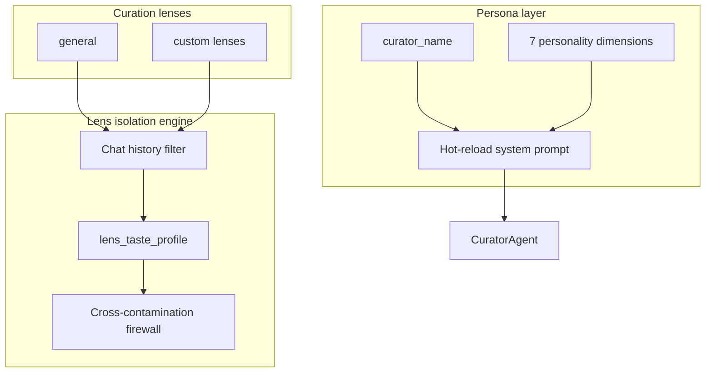
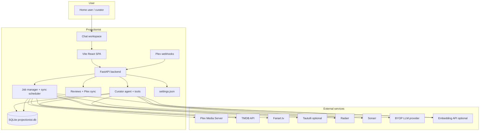
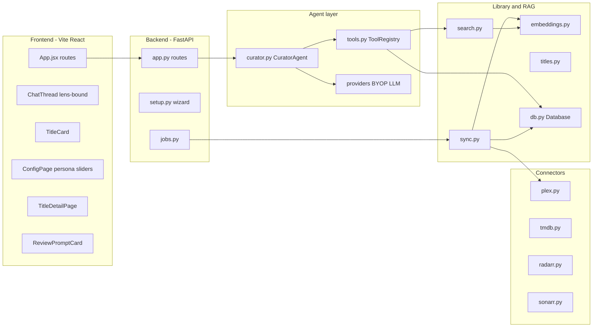
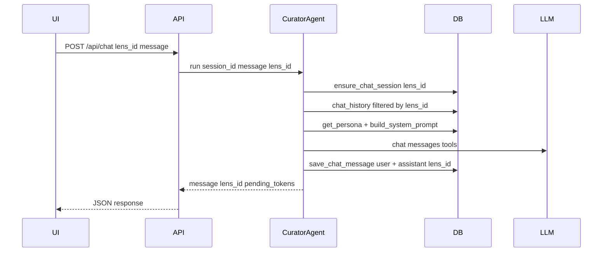
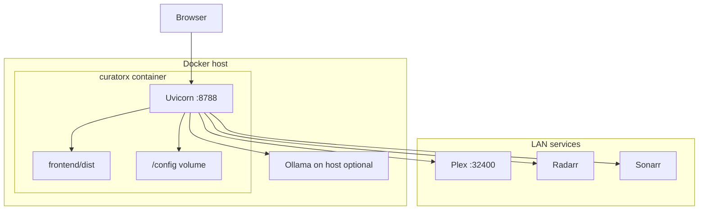

# Projectionist — Platform Architecture

Projectionist is an **ambient, chat-first curation companion** for Plex libraries. It combines a single-workspace chat UI, a tool-using LLM agent, RAG over your indexed library, **dynamic persona tuning**, personal **reviews** with optional Plex rating sync, **Plex webhooks** for near-completion rating prompts, and confirmation-gated Radarr/Sonarr actions. Curation **lenses** remain an internal/advanced agent context mechanism (taste/history isolation) — not a parallel product surface beside chat.

It is a **separate product** from [Reclaimspace](https://github.com/romwil/reclaimspace): Reclaimspace reclaims disk space by quarantining duplicate Plex files; Projectionist helps you discover, add, watch, and purge titles based on taste and usage within explicit cognitive boundaries.

---

## Vision and goals

| Goal | How Projectionist addresses it |
|------|---------------------------|
| **Intent-aware curation** | Ambient context + chat; lenses sandbox taste for advanced/agent isolation |
| **Anti-monolith taste** | `lens_id` on chat, telemetry, and taste profiles prevents context contamination (advanced) |
| **Chat-first interaction** | Single chat workspace with welcome panel, watchlist, and status dock |
| **Informed recommendations** | RAG embeddings + TMDB discovery grounded in library ownership |
| **Safe automation** | Radarr/Sonarr writes require explicit confirmation tokens |
| **Self-hosted, BYOP LLM** | OpenAI-compatible, Anthropic, or Ollama |
| **Homelab friendly** | Single Docker container, SQLite, Unraid template |

Non-goals: cloud SaaS, automatic file deletion without confirmation, generic streaming-service recommendations. Multi-user auth (**Sign in with Plex** PIN, optional **local password**, optional **OIDC**), Seerr, and Plex collections are **optional** (off by default); see [CONFIGURATION.md](CONFIGURATION.md#feature-flags-optional-off-by-default).

### Design thesis — MCP over local data

Projectionist is a production-quality example of a **Model Context Protocol interface** against structured and unstructured local data. The LLM never sees raw credentials or bulk exports; it issues targeted tool calls against a pre-indexed SQLite store that returns exactly the slice needed for each conversational turn.

> "The LLM gets to act like a natural language surgeon on a highly optimized, predictable local dataset. It's incredibly fast, it's cheap, and it keeps your Plex token and personal collection server info locked down."

This pattern — privacy-first MCP bridging a conversational AI to a rich personal dataset — generalizes beyond media curation. Projectionist demonstrates the approach end-to-end: dual trust-plane keys, confirm-gated mutations, and field-level redaction per mode. See [MCP.md](MCP.md) for the protocol surface.

---

## Cognitive architecture



- **Default lens:** `general` — seeded at database init.
- **Active lens:** stored in `curator_system_config.active_lens_id`.
- **Chat isolation:** `chat_messages.lens_id` filters history per lens within a session.
- **Explicit lock:** `lens_taste_profile.explicit_lock` blocks automatic telemetry drift on protected clusters.

The original product PRD (`curatorx_prd.md`) is historical only and is retained locally under `archive/docs/archive/` (gitignored), not in the shared tree.

---

## System context



The application runs as a **single process** (Uvicorn + FastAPI). The React frontend builds to static assets served from the same origin. Persistent state lives under `DATA_DIR` (default `/config` in Docker).

---

## Component architecture



### Frontend (Vite / React)

- **Single workspace** — chat thread, welcome panel, watchlist sidebar, keyboard shortcuts.
- **Explore hub** — `/explore` cinema browse (Recently Added + feed rails); Plot Lab for multi-signal plot intersections + neighbor discovery.
- **Help** — `/help` in-app guide (role-aware); deep education in [CURATOR_KNOWLEDGE.md](CURATOR_KNOWLEDGE.md).
- **Title detail** — `/title/{movie|show}/{id}` with backdrop hero, neighbors carousel, trailer modal.
- **Dual theme** — Lights Up (gallery paper) / Lights Down (cinema chamber) via `html[data-theme]`.
- **ChatThread** — blocks (`text`, `title_cards`, `action_prompt`, review prompts) plus circular **AgentAvatar**.
- **ConfigPage** — setup wizard, persona sliders, live service validation.

See [WEB_UI.md](WEB_UI.md) and [DESIGN.md](DESIGN.md).

### Backend (FastAPI)

- REST + SSE under `/api/*`.
- **Lens API** — `/api/lenses`, `/api/lenses/active`.
- **Persona API** — `/api/persona`, `/api/system-config`.
- **Reviews API** — `/api/reviews` with optional Plex rating sync and conflict handling.
- **Explore feeds** — `/api/library/feeds/*`, `/api/library/neighbors/{item_id}`, `/api/library/motifs`, `/api/library/knowledge-coverage`.
- **Webhooks** — `POST /api/webhooks/plex` for near-completion rating prompts (optional shared secret).
- **JobManager** — background library sync with progress polling.
- **CuratorAgent** — accepts `lens_id`; builds persona-aware system prompt; tool list respects feature flags.

### Library and RAG

Plex sync → SQLite upsert → TMDB enrichment (sync + idle trickle) → layered plot text → embeddings → materialized neighbors → title_relations graph → semantic / facet / feed queries. Structured credits (`people` / `credits`) dual-write alongside legacy JSON cast/directors arrays.

### Connectors

Thin HTTP clients for Plex, TMDB, *arr, Fanart, Tautulli, TVDB.

---

## Data flows

### Chat / agent turn (lens-scoped)



### Library sync

`POST /api/library/sync` → JobManager → Plex/Radarr/Sonarr/TMDB → embeddings. Jobs persist under `DATA_DIR/jobs_state.json`; inspect `GET /api/jobs` for phase / percent / message. Interrupted runs after restart are marked failed with a recovery message; a new sync resumes from the last valid phase checkpoint (≤72h).

### Add-to-Radarr confirmation

Two-phase: propose token → user confirm → execute. TTL 600 seconds.

---

## Technology stack

| Layer | Choice | Rationale |
|-------|--------|-----------|
| Runtime | Python 3.10+ | Async-friendly, homelab standard |
| Web | FastAPI + Uvicorn | Typed routes, SSE |
| Frontend | Vite + React | Single-workspace SPA without SSR complexity |
| Database | SQLite | Zero-ops; single-file backup |
| Vectors | NumPy + JSON in SQLite | Adequate for home libraries |
| Container | Multi-stage Docker | Node build + Python slim |

---

## SQLite concurrency model

Projectionist runs as a single process with multiple concurrent writers: the FastAPI request handlers (asyncio tasks on the main thread), the idle scheduler (asyncio background task), and telemetry ingestion (daemon threads). SQLite's default journal mode (`DELETE`) only allows one reader *or* one writer at a time, which would cause `database is locked` errors under concurrent access. Three mechanisms work together to prevent this.

### WAL mode (write-ahead logging)

Every connection sets `PRAGMA journal_mode=WAL` on open (`db.py._open_connection`). WAL mode is persistent — once set on a database file it survives restarts — but we set it per-connection defensively. With WAL:

- **Readers never block writers.** A chat-turn SELECT runs concurrently with a scheduler INSERT without contention.
- **Writers never block readers.** An active library sync doesn't freeze the web UI.
- **Only one writer** can commit at a time (SQLite fundamental), but the WAL makes the write-lock window very short compared to DELETE journal mode.

### Busy timeout (30 seconds)

Every connection sets `PRAGMA busy_timeout=30000`. When a writer encounters a locked database, SQLite retries internally for up to 30 seconds before raising `OperationalError`. This absorbs brief write overlaps (e.g. a telemetry insert landing at the same moment as a scheduler commit) without application-level retry logic. The Python-level `timeout` parameter on `sqlite3.connect()` is set to the same value for consistency.

On top of busy_timeout, the `run_with_db_lock_retry` utility adds application-level exponential backoff for critical multi-row writes (batch upserts, embedding stores) — up to 6 retries with jittered delays. This two-layer approach handles both brief contention (SQLite-level) and sustained bursts (application-level).

### Synchronous = NORMAL

With WAL, `PRAGMA synchronous=NORMAL` avoids an fsync on every commit while still guaranteeing durability against application crashes. Data loss is only possible on an OS crash or power failure *during* a commit — an acceptable tradeoff for a homelab media curator running on Unraid/NAS hardware where fsync can be especially slow over network-attached storage.

### Write serializer model

Under a loaded household (chat SSE + Plex webhook enqueue + telemetry threads + scheduler batch upserts), WAL + busy_timeout alone can still surface as lock warnings and stalled streams. Projectionist therefore runs a **dedicated write serializer** inside `Database`:

- **One background writer thread** owns mutating work submitted via `Database.run_write(fn)`. A dedicated thread is simpler than an asyncio task because most ambient writers are already sync callables (telemetry daemon threads, lock-retry upserts).
- **Readers keep short-lived WAL connections** on the caller thread via `connect()` — concurrent reads must not regress.
- **Ambient writers enqueue**: telemetry inserts, scheduler batch upserts (`run_with_db_lock_retry` paths), webhook rating-prompt enqueue, and chat message persist. Nested `run_write` on the writer thread is re-entrant.
- **Backpressure**: bounded queue (default 128); `put` blocks when full so producers slow down instead of unbounded memory growth.
- **Shutdown ordering**: FastAPI lifespan stops the idle/sync schedulers, then `Database.close()` drains the write queue and joins the writer thread.
- **Error propagation**: exceptions inside submitted callables are re-raised on the waiting caller thread.
- **Observability**: `Database.write_queue_stats()` exposes queue depth, last/max/avg wait seconds; slow waits also log at INFO.

WAL mode, `busy_timeout=30000`, and `run_with_db_lock_retry` remain the lower layers. The serializer sits above them for ambient contention; MySQL/Postgres migration stays out of scope for the homelab single-file model.

### Event-loop offload (SSE / hot paths)

Chat SSE (`GET /api/chat/stream` → `stream_agent`) must not run blocking `sqlite3` or long pure-Python cosine scans on the asyncio loop. Hot paths use `await run_db(fn, …)` (`asyncio.to_thread` in `projectionist/library/db_io.py`): history load + assistant persist, mid-stream library search queries, Plex webhook enqueue, and semantic/neighbor cosine work. This is **not** a thread-per-request model for the whole app — only sync I/O and CPU bursts leave the loop. `run_with_db_lock_retry`'s blocking `time.sleep` stays correct because those retries run on the writer thread (or a `run_db` worker), never on the loop.

### Trickle ingestion for embeddings

The `semantic_embeddings` scheduler task is the heaviest writer. To avoid pegging CPU and holding the write lock during large backfills (e.g. 500 new movies after an initial sync), it uses trickle ingestion:

- **Per-cycle cap** (`MAX_ITEMS_PER_CYCLE = 50`): embeds at most 50 items per scheduler invocation, then exits with `cycle_limit` status. Remaining items are picked up on the next idle cycle.
- **Batched API calls** (`BATCH_SIZE = 10`): items are sent to the embedding API in batches of 10, with an `asyncio.sleep(0)` yield between batches to allow other coroutines to run.
- **Cooperative interruption**: `should_stop()` is checked between batches, so if a chat request arrives the task yields immediately.

---

## Deployment architecture



See [DOCKER.md](DOCKER.md) for Mac Colima, Unraid, and Compose details.

---

## Agent tools vs. background scheduler

Projectionist has two execution paths that operate on the same data. Understanding the boundary prevents duplication and clarifies where new functionality belongs.

```
User Chat ──► CuratorAgent ──► Tools ──► DB ◄── Scheduler Tasks ◄── IdleScheduler
              (sync, <2s)                         (async, batch)
```

### Agent tools — synchronous, user-triggered

Defined in `projectionist/agent/tools.py`. Executed within a single chat turn when the user asks a question or requests an action. Tools call into `db.py` and external APIs (TMDB, Radarr, Sonarr, Plex). Results flow back to the LLM for response generation.

**Characteristics:** latency-sensitive (<2 seconds), scoped to one user query, read-heavy with occasional confirmed writes.

### Background scheduler — asynchronous, system-triggered

Defined in `projectionist/scheduler/engine.py` with individual tasks in `projectionist/scheduler/tasks/`. The `IdleScheduler` runs during idle periods (no chat activity for N minutes) and executes maintenance and enrichment tasks sequentially to avoid SQLite write contention.

**Characteristics:** batch-oriented, minutes-long, produces data that agent tools later consume. Each task receives a `should_stop` callback for cooperative interruption when chat activity resumes.

### The boundary rule

| If it…                                            | It belongs in…         |
|---------------------------------------------------|------------------------|
| Takes <2s and answers a user question              | Agent tool             |
| Is batch processing, enrichment, or maintenance    | Scheduler task         |
| Takes >30s or touches every row in a table         | Scheduler task         |
| Reads pre-computed results for a chat response     | Agent tool (consumer)  |

Some features span both sides. The scheduler pre-computes; the agent tool (or Explore API) reads the results:

| Scheduler produces | Consumers |
|--------------------|-----------|
| `semantic_embeddings` | `search_library`, semantic `query_library` |
| `metadata_enrichment` | release dates, TMDB overview/tagline, collection ids, structured credits |
| `plot_neighbors` → `item_neighbors` | `find_similar_titles`, Title Detail “More Like This”, `/api/library/neighbors/{id}` |
| `summary_motifs` / `keyword_theme_tagging` → `library_facets` | `get_facet_catalog` (`motif` / `theme`), Explore Plot Lab (hybrid also reads keywords/themes + live plot text incl. optional `long_synopsis`) |
| `title_relations_refresh` → `title_relations` | `list_relations`, `walk_relations` |
| `llm_logline_enrichment` | layered embedding text (optional; never invents plot) |
| `anniversary_scanner` | `get_todays_anniversaries`, On This Day feed fallback |
| `recommendation_warmup` | agent recommendation caches |
| `taste_refresh` | persona/taste personalization |
| `health_metrics` | `/api/library/health`, owner dashboard |

### Metadata trickle (sync vs idle)

**Sync** (user/API/schedule-triggered) must stay responsive: Plex scan, durable phase checkpoints, bounded TMDB enrichment workers, facet/FTS rebuild. It records honest provenance fields (`added_at` from Plex, ISO `release_date` / `first_air_date` from TMDB when present — **never invented from year alone**).

**Idle trickle** fills gaps without pegging the homelab box:

1. `metadata_enrichment` — missing dates, overviews, taglines, collection ids, credits
2. `semantic_embeddings` — capped batches (see [Trickle ingestion](#trickle-ingestion-for-embeddings))
3. `plot_neighbors` — materialize top-K cosine (+ surprise) into `item_neighbors`, preferring titles still missing neighbor rows (`neighbors_backlog`)
4. `summary_motifs` / `keyword_theme_tagging` / optional `long_synopsis_enrichment` / optional `llm_logline_enrichment`
5. `title_relations_refresh` — collection + neighbor + shared-crew edges

Batch sizes for (1)–(3) and loglines are **auto-tuned** from durable run history (see [Active auto-tune](#active-auto-tune-batch--interval)); agent tools and Explore feeds **read caches**; they do not recompute embeddings or graphs per chat turn.

### Materialized similarity & relations

Homelab SQLite cannot afford full pairwise cosine on every “more like this” click. Pattern:

1. Store vectors in `embeddings` (with `embedding_model` for rebuild hygiene).
2. Idle task writes top neighbors to `item_neighbors` (`score`, `surprise_score`).
3. Optional graph mirror in `title_relations` (`collection`, `neighbor`, `shared_crew`, optional `llm_theme`).
4. UI/API/agent tools SELECT from those tables.

**Optional ANN prefilter:** when the [`sqlite-vec`](https://github.com/asg017/sqlite-vec) package loads successfully, `plot_neighbors` / `semantic_search` build a shadow `vec_embeddings` virtual table and KNN-prefilter candidates before the same exact cosine + surprise scoring. Default images omit the package so Unraid installs keep working; set `PROJECTIONIST_SQLITE_VEC=0` to force the exact path even if the package is present. Install with `pip install 'projectionist[vec]'` (or `pip install sqlite-vec`) inside a custom image when you want ANN.

Empty neighbor/relation responses are **honest** — they mean the idle cache has not been built yet, not that the library has no similar titles.

### Explore feed APIs

| Endpoint | Source | Honesty rule |
|----------|--------|--------------|
| `GET /api/library/feeds/recently-added` | `library_items.added_at` | Empty + note if sync never recorded `added_at` |
| `GET /api/library/feeds/recent-releases` | `release_date` / `first_air_date` | Empty + note if no enriched dates (no year faking) |
| `GET /api/library/feeds/revisit-these` | partially watched TV + idle `last_viewed_at` / `last_episode_watched_at` ≥ 60d | Random ≤20; empty + note when none qualify |
| `GET /api/library/feeds/on-this-day` | calendar month-day match, else milestone-year fallback | `mode` field discloses which path ran |
| `GET /api/library/neighbors/{item_id}` | `item_neighbors` | Empty until `plot_neighbors` ran |
| `GET /api/library/motifs` | `library_facets` where `facet_type='motif'` | Empty until motif task ran |
| `GET /api/library/knowledge-coverage` | facet/neighbor/plot column counts | Honest % coverage for Admin/Explore |
| `GET /api/library/query?motifs=…` | hybrid by default (`plot_match_mode`) | Motif ∪ keyword ∪ theme ∪ plot-text AND; `motifs` mode = facet-only |

### Plot Lab multi-signal search

Plot Lab chip walls used to AND only on stored motif facets. Because motif extraction is intentionally sparse (DF band + per-title budget), intersections like `bride` ∩ `coma` failed even when Plex/TMDB text contained both words and keywords already tagged revenge/martial-arts.

**Default (`plot_match_mode=hybrid`):** for each selected token, a title matches if **any** of these layers hit:

1. `library_facets` motif value
2. `library_facets` keyword value (or keywords JSON fallback)
3. Live plot text (`summary` / `tmdb_overview` / `tagline` / optional `long_synopsis` / `llm_logline`)
4. Theme facets from local keyword→theme map (`keyword_theme_tagging`)

Tokens are still AND’d across the selection. Why? responses cite which layer matched (`match_layers`). Operators can switch to `plot_match_mode=motifs` for pure facet walls.

This unlocks intersections without LLM tokens. Optional Wikipedia/OMDb `long_synopsis` and offline keyword→theme maps deepen text without burning LLM quota.

### Watchdog and circuit breaker

Each scheduler task runs with a configurable timeout (default 5 minutes). A per-task failure counter tracks consecutive failures; after 3 consecutive failures the task is **quarantined** — skipped on subsequent cycles until the cooldown period (default 1 hour) elapses or an admin clears it via `POST /api/admin/scheduled-tasks/{name}/reset`. Quarantine state is in-memory and resets on restart.

### Why last-run-only failed (and what replaced it)

For a long time Admin → Scheduled Tasks only persisted **last run** fields on `scheduled_tasks` (`last_run_at`, `last_duration_ms`, `last_status`, …). Live progress lines lived in an in-memory ring buffer (`TaskRunLogStore`) that **dies on restart**.

That answered “did the last cycle succeed?” but not:

- How fast are we actually clearing the backlog (items/hour)?
- Is ETA honest, or just `remaining ÷ batch × interval` with idle time ignored?
- Should batch/interval adapt when neighbors are thin but embeddings are full?

**Fix:** every finished execution also appends a row to durable `scheduled_task_runs` (name, timestamps, duration, status, trigger, outcome, metrics JSON, items_processed, error). The in-memory log remains for live monitoring; **SQLite is the source of truth for history**. `data_retention` prunes runs older than `task_run_retention_days` (default **60**).

Owner APIs:

| Endpoint | Purpose |
|----------|---------|
| `GET /api/admin/scheduled-tasks/{name}/history` | Recent durable runs |
| `GET /api/admin/scheduled-tasks/{name}/rate` | Aggregate items/hour, success rate, p50/p95 duration |
| `GET /api/admin/scheduled-tasks` | Includes `rate`, `progress.eta_source` (`measured` \| `theoretical`), `items_per_cycle` |

### Measured throughput and ETA

`progress.py` still computes a **theoretical** ETA from `items_per_cycle × interval`. When enough productive history exists, the list payload prefers **measured** `items_per_hour` from `scheduled_task_runs` and sets `eta_source=measured`. Admin UI shows both the ETA line and a measured-rate summary (success %, p50/p95). Drafting a new cadence falls back to theoretical until history reflects the new interval.

### Active auto-tune (batch + interval)

Trickle tasks with a backlog expose a persisted `scheduled_tasks.items_per_cycle` column (seeded from the task definition, owner-overridable). After each successful productive run of:

- `metadata_enrichment`
- `semantic_embeddings`
- `plot_neighbors`
- `llm_logline_enrichment`

the scheduler evaluates duration vs timeout and backlog ETA vs a target horizon (neighbors ≈ **7 days**), then nudges batch and/or interval within **safety caps** (e.g. neighbors batch 5–60, interval 15m–12h; LLM logline batch 1–10). Every decision is copied into that run’s `metrics` (`autotune_*` keys) for audit. Owners can still override interval and batch in Admin; the next tune only moves within caps.

### Neighbor catch-up

Embeddings can be complete while `item_neighbors` is still thin. `plot_neighbors` progress scope is **`neighbors_backlog`** (embedded titles missing neighbor rows), not a full embeddings pass. Each cycle **prefers seeds that lack neighbor rows**, then fills the remainder by rotating the embedding cursor — so auto-tune + catch-up densify the similarity graph without waiting on unrelated work.

### Curator knowledge depth (product model)

Library “understanding” is a **stack of dimensions** (identity → credits → keywords → plot text → motifs → themes → similarity graph), not a single motif wall. Short Plex/TMDB blurbs plus an 8-slot DF-capped unigram motif extract explain why Plot Lab AND intersections can miss titles that free text already describes (see the Kill Bill bride/coma case study).

Educational guide for owners and household users: **[CURATOR_KNOWLEDGE.md](CURATOR_KNOWLEDGE.md)**. In-app: **`/help`**.

**Roadmap hooks** (landing in parallel with this docs work):

| Phase | Intent |
|-------|--------|
| A | Motif extraction quality + Plot Lab multi-signal AND (motifs ∪ keywords ∪ plot text) |
| B | Durable `scheduled_task_runs`, measured throughput UI, auto-tune batch/interval |
| C | Optional long synopsis + local keyword→theme (LLM last) — **implemented** |
| D | Coverage UI + title Plot knowledge panel |

Phase B is implemented: Admin Scheduled Tasks show durable recent runs, measured items/hour when history exists, and auto-tuned batch/interval for trickle tasks. Prefer free sources before LLM — provenance rules unchanged.

---

## Curator memory subsystem

Projectionist persists knowledge across sessions in **two distinct scopes** so the curator behaves as if it remembers rather than starting cold each turn. The dual-scope model is installed by `_migrate_curator_memory` in `db.py`; per-scope tables are in [DATA_MODEL.md](DATA_MODEL.md#curator-memory).

| Scope | Store | Trust | Written by | Read by |
|-------|-------|-------|-----------|---------|
| **Repository memory** (shared, source-cited) | `memory_entities` + `memory_snapshots` + `memory_relations` + `memory_insights` + `memory_entity_activity` | Household-wide media knowledge | `research_*` tools, `save_repo_insight`, idle `entity_memory_enrichment` | `recall_repo_memory`, `search_memory`, agent prose |
| **Per-user memory** (private, fail-closed) | `user_memory_notes` (+ `user_memory_events`) | One `user_id` only | `remember_about_user` (and migrated `preference_facts`) | `recall_user_memory`, per-turn prompt injection |

### Research → snapshot → insight flow

```
recall_repo_memory / search_memory   (do I already know this?)
        │  miss / stale
        ▼
research_title / research_person / research_company
   → official APIs (TMDB, Wikipedia, optional OMDb/TVDB)
   → append memory_snapshots (payload + sources + fetched_at)
        │
        ▼
save_repo_insight  → memory_insights (+ citations {source, ref, note})
```

- Research is **durable cited retrieval**, not arbitrary web browsing/scraping — that guardrail is retained. Snapshots store only provider-normalized, **path-free** payloads (no Plex paths, rating keys, or credentialed URLs).
- **Freshness** is derived from the newest snapshot `fetched_at` vs the entity's "known since" (`created_at`). Idle `entity_memory_enrichment` refreshes a small batch of stale repository entities without pegging the box and never touches private user memory.
- `compare_filmographies` reports only transparent overlap/counts from TMDB — it never infers subjective similarity.

### Discussion activity

`memory_entity_activity` counts how often each entity comes up (incremented best-effort by recall/research; failures are non-fatal). Recall flags an entity as "frequently discussed" (≥3) so the curator can lean on established context and grooming can prioritize hot entities.

### Per-turn injection

`build_system_prompt(user_id, user_role)` injects a compact, privacy-safe "what you already know about this signed-in user" block plus a "resume where we left off" line drawn from `follow_up` / `watch_intention` notes. It reads **only the caller's own** notes, injects nothing when there is no signed-in user or no notes, and degrades silently on error. Prompts state plainly that persistent, cited memory exists and instruct the curator to consult it **before** declaring a gap.

### Privacy scoping

`UserMemoryService._authorize` is **fail-closed**: a caller reads only its own per-user notes; adults are isolated from each other and from the owner. The one exception is **owner youth review** — the owner may review/export a member account **only** when it carries the owner-set Youth flag (`users.is_youth`). Export is available to the account holder; purge hard-deletes that user's notes and chat sessions/messages atomically while shared repository knowledge remains intact. (Cross-user prompt-injection hardening for globally shared insights/snapshots is a tracked security follow-up, not yet landed.)

---

## Security model

| Topic | Behavior |
|-------|----------|
| Authentication | **None by default** — single implicit owner on trusted LAN. With `features.multi_user_enabled`, login via **Plex PIN**, optional **local password**, and/or **OIDC** (login page shows configured `auth_methods`); session cookies + middleware protect `/api/*` (allowlist: health/features/auth/webhooks) |
| Roles | Owner-only: settings, setup tests, library sync mutate, persona/lens writes. Guests cannot request media / *arr writes |
| Partitioning | Chat, pending actions, watchlist, reviews, preferences scoped by `user_id` when multi-user is on (shared library remains household-wide) |
| Feature gates | `GET /api/features` exposes enabled flags; auth UI, Seerr, and Plex collection tools stay hidden until opted in |
| Webhooks | Require non-empty `webhook_secret` / `PROJECTIONIST_WEBHOOK_SECRET` + matching `X-Projectionist-Webhook-Secret` |
| Destructive actions | Confirmation tokens for all *arr / Seerr writes; tokens bound to user when multi-user is on |
| Session secret | Auto-persisted under DATA_DIR; `PROJECTIONIST_SESSION_SECRET` preferred; public default refused for multi-user |
| Secrets | Masked on API read; env overrides file |
| Lens isolation | Chat and taste scoped by `lens_id`; no cross-lens history leakage in API |
| MCP | Optional stdio + HTTP `/mcp`; dual keys (`PROJECTIONIST_MCP_API_KEY` privacy / `PROJECTIONIST_MCP_FULL_API_KEY` full) |

See [SECURITY.md](SECURITY.md) and [wiki/Multi-User.md](wiki/Multi-User.md) for the full partitioning matrix.

---

## Extension points (1.8+)

| Extension | Status |
|-----------|--------|
| Curation lenses | **Implemented** — CRUD, active lens, chat filter |
| Persona templates / sliders | **Implemented** — 7 dimensions, per-conversation selector, hot-reload prompt |
| Single chat workspace | **Implemented** — see [WEB_UI.md](WEB_UI.md) and [DESIGN.md](DESIGN.md) |
| Dual theme + icon chrome | **Implemented** — Lights Up / Lights Down / Match system; Material icon top-bar |
| Explore hub | **Implemented** — `/explore` feed rails, Pulse strip, Plot Lab motifs/neighbors |
| Title detail + neighbors | **Implemented** — hero detail, trailer, “More Like This” from `item_neighbors` |
| Metadata enrichment + credits | **Implemented** — sync + idle trickle; `people` / `credits` tables |
| Layered plot text | **Implemented** — Plex summary + TMDB overview/tagline + optional `long_synopsis` + optional LLM logline |
| Materialized neighbors | **Implemented** — `item_neighbors` via `plot_neighbors` idle task |
| Title relations graph | **Implemented** — collection / neighbor / shared_crew (+ optional llm_theme) |
| Motif / theme facets | **Implemented** — `summary_motifs`, `keyword_theme_tagging` (local keyword map) |
| Named curated lists | **Implemented** locally; Plex Lists publish = **Future** (no stable Discover Lists API) |
| Owner dashboard | **Implemented** — `/admin/dashboard` composition, health, purge, taste |
| Idle task scheduler | **Implemented** — embeddings, enrichment, neighbors, relations, motifs, taste, health, …; circuit breaker |
| Durable sync jobs | **Implemented** — `jobs_state.json` + restart recovery |
| Reviews + Plex sync | **Implemented** — personal stars, conflict detection, webhook prompts |
| Plex webhooks | **Implemented** — near-completion rating queue; optional auth secret |
| Interaction telemetry | **Implemented** — non-blocking ingest + admin summary/events APIs |
| True LLM SSE streaming | **Implemented** — token/tool_call/done/error events |
| OIDC / local auth | **Implemented** — opt-in alongside Plex PIN; see [CONFIGURATION.md](CONFIGURATION.md) |
| Household recommendations | **Implemented** — peer recommend + unread inbox |
| Non-root Docker | **Implemented** — `curatorx` UID/GID 1000 + entrypoint chown |
| Agent blueprints | Schema present; richer scheduler wiring **Future** |
| Plex Lists publish | **Future** (pending stable Plex Discover API) |
| sqlite-vec ANN prefilter | **Implemented (optional)** — when `sqlite-vec` is installed (`pip install projectionist[vec]` or `PROJECTIONIST_SQLITE_VEC` not `0`), neighbor rebuild / semantic search ANN-prefilter candidates then exact-rescore; without the extension the pure-Python cosine path remains. `item_neighbors` stays the UI/agent read cache either way |
| TV season-decay taste | **Implemented** — `taste_refresh` folds `library_episodes` view/star curves with season decay so mid-series abandonment does not keep forcing later-season neighbors |
| Ephemeral Plex collection GC | **Implemented** — agent/movie-night shelves get a `[Projectionist]` prefix + TTL row; idle `collection_gc` prunes expired markers only (never evergreen collections without the marker); Admin dry-run toggle |

---

## Related documentation

- [CURATOR_KNOWLEDGE.md](CURATOR_KNOWLEDGE.md) — why/what/how of library knowledge, idle curation, Plot Lab
- [HELP.md](HELP.md) — in-app Help source (`/help`)
- [DESIGN.md](DESIGN.md) — UX principles, agent tools
- [DATA_MODEL.md](DATA_MODEL.md) — SQLite and PRD tables
- [wiki/Home.md](wiki/Home.md) — operator wiki
- [CONFIGURATION.md](CONFIGURATION.md) — settings reference
- [FAQ.md](FAQ.md) — common questions