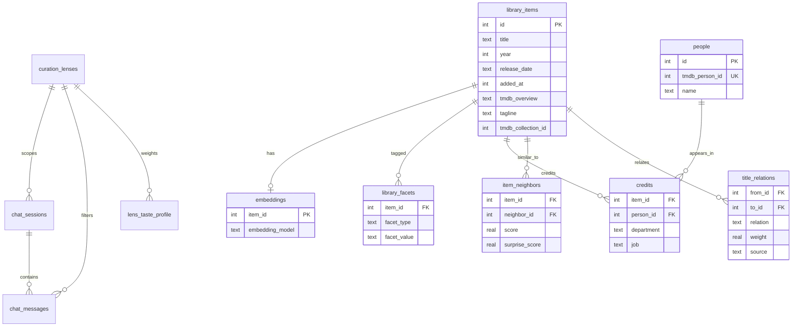

# Projectionist — Data Model

Reference for persistent storage: SQLite tables, settings fields, and Pydantic schemas. Schema definitions live in `projectionist/library/db.py` and `projectionist/models/schemas.py`.

---

## Storage layout

| Path | Format | Contents |
|------|--------|----------|
| `{DATA_DIR}/projectionist.db` | SQLite 3 | Library, embeddings, chat (lens-scoped), persona, lenses, preferences |
| `{DATA_DIR}/settings.json` | JSON | Connection settings and secrets |
| `{DATA_DIR}/jobs_state.json` | JSON | Durable background job history (library sync) |

Default `DATA_DIR`: `/config` in Docker, `./config` in local dev.

---

## SQLite schema

### Core library

#### `library_items`

Canonical Plex index enriched during sync and idle `metadata_enrichment`.

| Column | Type | Description |
|--------|------|-------------|
| `id` | INTEGER PK | Internal row ID |
| `rating_key` | TEXT UNIQUE | Plex rating key |
| `media_type` | TEXT | `movie` or `show` |
| `title` | TEXT | Display title |
| `year` | INTEGER | Release / first air **year** (coarse; not a substitute for ISO dates) |
| `summary` | TEXT | Plex/local blurb |
| `tmdb_overview` / `tagline` | TEXT | TMDB plot layers (empty until enriched) |
| `long_synopsis` | TEXT | Optional longer plot from Wikipedia/OMDb idle task; empty unless configured — **never invented** |
| `synopsis_source` | TEXT | Provenance for `long_synopsis` (`wikipedia` / `omdb`); empty when unset |
| `llm_logline` | TEXT | Optional idle LLM one-liner; empty unless task ran — **never invented** |
| `genres` | TEXT | JSON array |
| `cast` / `directors` / `keywords` | TEXT | JSON arrays (dual-written with `people`/`credits`) |
| `tmdb_id` / `tvdb_id` / `imdb_id` | | External IDs |
| `poster_url` / `backdrop_url` | TEXT | Art URLs |
| `runtime_minutes` / `content_rating` / `vote_average` | | TMDB/Plex intelligence fields |
| `original_language` / `countries` | TEXT | Language code; JSON country array |
| `release_date` / `first_air_date` / `last_air_date` | TEXT | ISO dates when known (`YYYY-MM-DD`) |
| `tmdb_collection_id` / `collection_name` | | Franchise / collection membership |
| `added_at` | INTEGER | Plex added timestamp (Unix); drives Recently Added feed |
| `view_count` | INTEGER | Plex plays |
| `last_viewed_at` | INTEGER | Unix timestamp |
| `view_offset_ms` | INTEGER | Plex partial-watch offset (milliseconds) |
| `duration_ms` | INTEGER | Plex media duration (milliseconds) |
| `file_size` | INTEGER | Bytes on disk |
| `in_radarr` / `in_sonarr` | INTEGER | 0/1 queue flags |
| `updated_at` | REAL | Last upsert |

**Indexes:** `tmdb_id`, `tvdb_id`, `media_type`, `added_at`, `release_date`, `tmdb_collection_id`.

#### Provenance rules (dates & plot text)

Projectionist treats missing metadata as a first-class state. Feeds and agent tools must not invent facts:

| Field | Source of truth | Must not |
|-------|-----------------|----------|
| `added_at` | Plex library | Invent “recently added” from `updated_at` alone |
| `release_date` / `first_air_date` | TMDB ISO date | Fabricate from `year` (year is coarse only) |
| `summary` | Plex | Overwrite with hallucinated synopsis |
| `tmdb_overview` / `tagline` | TMDB | Fill from LLM guesswork |
| `long_synopsis` / `synopsis_source` | Optional Wikipedia/OMDb idle task | Overwrite Plex/TMDB; invent when source off or fetch misses |
| `llm_logline` | Optional idle LLM task | Run without a configured provider; invent when task skipped |

Sync and `metadata_enrichment` use `COALESCE` / non-empty guards so empty TMDB fields do not wipe good prior data — and empty stays empty when the source has nothing.

#### `people` / `credits`

Normalized cast & crew (Stage 1). JSON `cast` / `directors` on `library_items` remain for backward-compatible card rendering; person browse and shared-crew relations use these tables.

| Table | Key columns |
|-------|-------------|
| `people` | `id`, `tmdb_person_id` UNIQUE, `name`, `profile_url`, `created_at` |
| `credits` | PK `(item_id, person_id, department, job, character)`; `billing_order`; FKs to `library_items` / `people` |

#### `embeddings`

| Column | Type | Description |
|--------|------|-------------|
| `item_id` | INTEGER PK FK | References `library_items.id` |
| `vector` | TEXT | JSON float array (384-dim hash or provider length) |
| `embedding_model` | TEXT | Model id that produced the vector (rebuild hygiene) |

Layered embedding input uses summary + TMDB overview/tagline + optional `long_synopsis` + optional `llm_logline` (plot section repeated for mild narrative weighting).

#### `item_neighbors`

Materialized plot similarity cache (idle `plot_neighbors`). Read by Explore, Title Detail, and `find_similar_titles`.

| Column | Type | Description |
|--------|------|-------------|
| `item_id` / `neighbor_id` | INTEGER PK | Library item pair |
| `score` | REAL | Cosine similarity |
| `surprise_score` | REAL | High cosine with low genre/keyword/credit overlap |

#### `title_relations`

Lightweight title graph (idle `title_relations_refresh`).

| Column | Type | Description |
|--------|------|-------------|
| `from_id` / `to_id` | INTEGER | Library item endpoints |
| `relation` | TEXT | `collection`, `neighbor`, `shared_crew`, optional `llm_theme` |
| `weight` | REAL | Edge strength |
| `source` | TEXT | Provenance label (`tmdb_collection`, `item_neighbors`, …) |

**PK:** `(from_id, to_id, relation)`.

#### `library_facets` (motif / theme)

| Column | Type | Description |
|--------|------|-------------|
| `item_id` | INTEGER FK | References `library_items.id` |
| `facet_type` | TEXT | Sync types (`genre`, `director`, …) plus idle `motif` / `theme` |
| `facet_value` | TEXT | Facet string |

Idle motif/theme replaces only its own `facet_type` so sync-managed facets are preserved.

##### Why motifs were sparse (and what changed)

`summary_motifs` builds searchable plot tokens from layered text (`summary` + `tmdb_overview` + `tagline` + optional `long_synopsis` + optional `llm_logline`). Early versions kept only **8 rare unigrams per title** after a document-frequency band. That hard cap routinely crowded out high-signal words that still appear in the blurb — e.g. Kill Bill Vol. 1 literally contains “The Bride” + “coma”, but attached motifs kept `coma` and dropped `bride`; Vol. 2 stored the possessive `bride's` instead of `bride`. Plot Lab AND on motifs alone was therefore structurally blind even when the library “knew” the film.

Current extraction:

1. **Possessive normalize** — `bride's` → `bride`
2. **Unigrams + high-signal bigrams** — e.g. `the bride`, `death list`
3. **Split per-title budget** — top rare tokens **plus** guaranteed retention for tokens that also appear as keyword stems
4. **Plot Lab hybrid query** (default) — each selected token may match via motif / keyword / theme facet **or** live plot-text `LIKE` (including `long_synopsis`), AND across tokens; pure motif-AND remains available via `plot_match_mode=motifs`

**Themes (no LLM):** idle `keyword_theme_tagging` maps frequent TMDB keywords onto a small controlled vocabulary and writes `facet_type='theme'`.

Knowledge coverage stats (`GET /api/library/stats` → `knowledge_coverage`, or `/api/library/knowledge-coverage`) expose % with overview / motifs / keywords / neighbors / loglines so sparsity stays visible to Admin/Explore.

Product explanation: [CURATOR_KNOWLEDGE.md](CURATOR_KNOWLEDGE.md). Durable `scheduled_task_runs` history + auto-tune: [ARCHITECTURE.md](ARCHITECTURE.md#why-last-run-only-failed-and-what-replaced-it).

#### `preference_facts`

Taste signals for agent context and purge scoring.

| Column | Type | Description |
|--------|------|-------------|
| `id` | INTEGER PK | |
| `signal_type` | TEXT | `explicit`, `positive`, `negative`, `add`, `dismiss` |
| `text` | TEXT | Natural language description |
| `weight` | REAL | Signed weight |
| `tmdb_id` / `tvdb_id` / `media_type` | | Optional title scope |
| `created_at` | REAL | Unix timestamp |

#### `chat_sessions`

| Column | Type | Description |
|--------|------|-------------|
| `id` | TEXT PK | Session UUID |
| `created_at` / `updated_at` | REAL | |
| **`lens_id`** | TEXT | **Curation lens scope** (default `general`) |

#### `chat_messages`

| Column | Type | Description |
|--------|------|-------------|
| `id` | TEXT PK | Message UUID |
| `session_id` | TEXT FK | References `chat_sessions.id` |
| `role` | TEXT | `user`, `assistant`, `system` |
| `blocks_json` | TEXT | JSON message blocks |
| `created_at` | REAL | |
| **`lens_id`** | TEXT | **Lens filter for history queries** (default `general`) |

Chat history API and agent context load messages filtered by `lens_id` so lenses remain isolated within a session.

#### `message_feedback`

Helpful / not-helpful reactions on assistant messages (curator training signals).

| Column | Type | Description |
|--------|------|-------------|
| `id` | TEXT PK | Feedback row UUID |
| `message_id` | TEXT FK | References `chat_messages.id` |
| `session_id` | TEXT FK | References `chat_sessions.id` |
| `user_id` | TEXT FK nullable | References `users.id`; bootstrap owner when multi-user is off |
| `feedback_type` | TEXT | `helpful` or `not_helpful` |
| `excerpt` | TEXT | Truncated assistant message text sent to preference training |
| `created_at` | REAL | Unix timestamp |

Unique per `(message_id, user_id)`. POST feedback also writes a `positive` or `negative` row to `preference_facts` via `remember_preference`.

#### `watchlist_pins`

Personal shelf of titles pinned from chat title cards.

| Column | Type | Description |
|--------|------|-------------|
| `id` | TEXT PK | Pin UUID |
| `user_id` | TEXT FK nullable | References `users.id`; NULL when multi-user is off |
| `tmdb_id` | INTEGER | Movie TMDB id (optional) |
| `tvdb_id` | INTEGER | Show TVDB id (optional) |
| `media_type` | TEXT | `movie` or `show` |
| `title` | TEXT | Display title |
| `created_at` | REAL | Unix timestamp |

Unique per `(user_id, media_type, tmdb_id, tvdb_id)`.

#### `curated_lists`

Per-user named shelves (local Projectionist lists). Plex Lists publish is deferred — see FAQ.

| Column | Type | Description |
|--------|------|-------------|
| `id` | TEXT PK | List UUID |
| `user_id` | TEXT FK nullable | References `users.id`; NULL when multi-user is off |
| `name` | TEXT | Display name (unique per user) |
| `description` | TEXT | Optional blurb |
| `created_at` | REAL | Unix timestamp |
| `updated_at` | REAL | Unix timestamp |

#### `curated_list_items`

Titles on a curated list (TMDB/TVDB identity; optional library link).

| Column | Type | Description |
|--------|------|-------------|
| `id` | TEXT PK | Item UUID |
| `list_id` | TEXT FK | References `curated_lists.id` |
| `tmdb_id` | INTEGER | Optional TMDB id |
| `tvdb_id` | INTEGER | Optional TVDB id |
| `media_type` | TEXT | `movie` or `show` |
| `title` | TEXT | Display title |
| `library_item_id` | INTEGER FK nullable | Best-effort link to `library_items.id` |
| `position` | INTEGER | Order within the list |
| `created_at` | REAL | Unix timestamp |

Unique per `(list_id, media_type, tmdb_id, tvdb_id)`.

#### `users`

Household accounts (schema present; login enforced only when `features.multi_user_enabled` is true).

| Column | Type | Description |
|--------|------|-------------|
| `id` | TEXT PK | Projectionist user id (`bootstrap-owner` for single-user installs) |
| `display_name` | TEXT | Shown in UI |
| `email` | TEXT | Optional |
| `role` | TEXT | `owner`, `member`, or `guest` |
| `plex_user_id` | TEXT UNIQUE | Plex account link |
| `plex_token_enc` | TEXT | Optional encrypted Plex token (Seerr bridge) |
| `seerr_user_id` | INTEGER | Cached Seerr user id |
| `seerr_permissions` | INTEGER | Cached Seerr permission bitmask |
| `oidc_sub` | TEXT UNIQUE | OIDC subject |
| `avatar_url` | TEXT | Optional |
| `created_at` | REAL | |
| `last_login_at` | REAL | |

On first run with multi-user disabled, a bootstrap **owner** row is inserted automatically.

#### `pending_actions`

Confirmation-gated *arr operations (10-minute TTL).

| Column | Type | Description |
|--------|------|-------------|
| `token` | TEXT PK | UUID hex |
| `action_type` | TEXT | `add_radarr`, `add_sonarr`, `remove_arr` |
| `payload_json` | TEXT | Action-specific JSON |
| `created_at` / `expires_at` | REAL | |

#### `sync_state`

Key-value job metadata (e.g. `last_sync` JSON with item/embedding counts).

---

### Curator memory

The curator has **two memory scopes** (dual-scope model installed by `_migrate_curator_memory`): shared, source-cited **repository memory** about titles/people/companies, and private, per-account **user memory**. See [ARCHITECTURE.md](ARCHITECTURE.md#curator-memory-subsystem) and [DESIGN.md](DESIGN.md#curator-memory-model-110).

#### `memory_entities`

The subject of repository knowledge — a title, person, company, location, or other.

| Column | Type | Description |
|--------|------|-------------|
| `id` | TEXT PK | Entity id |
| `entity_type` | TEXT | `person`, `company`, `title`, `location`, or `other` (CHECK-constrained) |
| `name` | TEXT | Display name |
| `external_ids_json` | TEXT | JSON map of external ids (TMDB/TVDB/IMDb), default `{}` |
| `library_item_id` | INTEGER | Optional link to `library_items.id` |
| `created_at` / `updated_at` | REAL | Unix timestamps; `created_at` is "known since" |
| `archived_at` | REAL | Soft-archive timestamp (nullable) |

Unique per `(entity_type, name)`.

#### `memory_snapshots`

Append-only research snapshots for an entity (freshness = latest `fetched_at`). Written by `research_*` tools and idle `entity_memory_enrichment`.

| Column | Type | Description |
|--------|------|-------------|
| `id` | TEXT PK | Snapshot id |
| `entity_id` | TEXT FK | References `memory_entities(id)` |
| `payload_json` | TEXT | Provider-normalized, **path-free** research payload |
| `sources_json` | TEXT | JSON array of provenance sources, default `[]` |
| `fetched_at` | REAL | When the provider data was retrieved (drives freshness) |
| `created_at` | REAL | Row insert time |

#### `memory_relations`

Optional edges between entities (e.g. person↔title), attributable to a snapshot.

| Column | Type | Description |
|--------|------|-------------|
| `id` | TEXT PK | Relation id |
| `source_entity_id` / `target_entity_id` | TEXT FK | Endpoints in `memory_entities` |
| `relation_type` | TEXT | Relation label |
| `snapshot_id` | TEXT FK nullable | Sourcing `memory_snapshots(id)` |
| `created_at` | REAL | Unix timestamp |

#### `memory_insights`

Durable, source-cited synthesis saved via `save_repo_insight` (Scholar cited knowledge).

| Column | Type | Description |
|--------|------|-------------|
| `id` | TEXT PK | Insight id |
| `entity_id` | TEXT FK | References `memory_entities(id)` |
| `insight` | TEXT | The lasting fact / synthesis |
| `citations_json` | TEXT | JSON citations (`{source, ref, note}`) so the claim is repeatable with provenance |
| `created_at` | REAL | Unix timestamp |
| `archived_at` | REAL | Soft-archive timestamp (nullable) |

#### `memory_entity_activity`

Best-effort discussion counter per entity (never fatal); lets recall flag "frequently discussed" and grooming prioritize hot entities.

| Column | Type | Description |
|--------|------|-------------|
| `entity_id` | TEXT PK FK | References `memory_entities(id)` |
| `discussion_count` | INTEGER | Times the entity has come up (default 0) |
| `last_discussed_at` | REAL | Unix timestamp (nullable) |

#### `user_memory_notes`

Private per-account memory behind `UserMemoryService` (fail-closed authorization).

| Column | Type | Description |
|--------|------|-------------|
| `id` | TEXT PK | Note id (migrated preference rows use a `pref-` prefix) |
| `user_id` | TEXT FK | References `users(id)` **ON DELETE CASCADE** |
| `kind` | TEXT | `self_disclosure`, `learning_goal`, `watch_intention`, `watched_external`, `follow_up`, or `preference` |
| `text` | TEXT | The note |
| `metadata_json` | TEXT | JSON metadata (default `{}`); preference migration stores `signal_type`, `weight`, `tmdb_id`, `tvdb_id`, `media_type` |
| `created_at` / `updated_at` | REAL | Unix timestamps |
| `archived_at` | REAL | Soft-archive timestamp (nullable) |

Indexed by `(user_id, created_at DESC)`. `preference_facts` is migrated **idempotently** into this table (`INSERT OR IGNORE`, `pref-`-prefixed ids); legacy `preference_facts` rows are retained only as a rollback-compatibility source and new account-scoped writes use this unified store.

#### `user_memory_events`

Lightweight per-user activity log for memory operations.

| Column | Type | Description |
|--------|------|-------------|
| `id` | TEXT PK | Event id |
| `user_id` | TEXT | Owning account |
| `event_type` | TEXT | Event label |
| `target_id` | TEXT | Optional related id (nullable) |
| `created_at` | REAL | Unix timestamp |
| `metadata_json` | TEXT | JSON metadata (default `{}`) |

#### Provenance & freshness rules (memory)

- **Path-free by construction.** Only provider-normalized payloads enter repository memory — local file paths, Plex rating keys, and credentialed URLs are never stored.
- **Freshness = latest snapshot.** `recall_repo_memory` / `search_memory` derive freshness from the newest `memory_snapshots.fetched_at` vs `memory_entities.created_at` ("known since"); stale entities are refreshed by idle `entity_memory_enrichment`, never per chat turn.
- **Citations travel with claims.** Insights carry `citations_json` so the curator cites in prose from tool output — there is no separate citation UI.
- **Privacy scoping.** A user reads only their own `user_memory_notes`; the owner may review/export another account **only** when it is Youth-flagged (`users.is_youth`). Purge hard-deletes a user's notes + chat sessions/messages atomically while shared repository knowledge remains intact.

---

### PRD cognitive tables

From the historical PRD (local `archive/docs/archive/curatorx_prd.md`, not in the shared tree):

#### `curator_system_config`

| Column | Type | Description |
|--------|------|-------------|
| `config_key` | TEXT PK | e.g. `active_lens_id`, `curator_name` |
| `config_value` | TEXT | |
| `updated_at` | DATETIME | |

#### `service_integrations`

| Column | Type | Description |
|--------|------|-------------|
| `service_name` | TEXT PK | `plex`, `radarr`, `sonarr`, `tmdb`, … |
| `base_url` | TEXT | |
| `credential_marker` | TEXT | Presence marker only (`***configured***`) — not ciphertext; secrets live in encrypted `settings.json` |
| `connection_status` | TEXT | `unverified`, `verified`, `error` |
| `last_tested_at` | DATETIME | |

#### `curator_persona_metrics`

| Column | Type | Description |
|--------|------|-------------|
| `metric_id` | TEXT PK | Default `current_profile` |
| `curator_name` | TEXT | Display name (default `Curator`) |
| `val_bro_prof` | REAL | Vocabulary: bro (0) → professorial (1) |
| `val_dipl_snark` | REAL | Tone: diplomatic (0) → snarky (1) |
| `val_pass_auto` | REAL | Autonomy: passive (0) → autonomous (1) |
| `last_modified` | DATETIME | |

#### `curation_lenses`

| Column | Type | Description |
|--------|------|-------------|
| `lens_id` | TEXT PK | e.g. `general`, `directors` |
| `lens_name` | TEXT | Display name |
| `description` | TEXT | Optional |
| `created_at` | DATETIME | |

Seeded on init: **`general`** lens.

#### `lens_taste_profile`

| Column | Type | Description |
|--------|------|-------------|
| `lens_id` | TEXT FK | References `curation_lenses` |
| `cluster_tag` | TEXT | Taste cluster identifier |
| `weight` | REAL | Default 1.0 |
| `explicit_lock` | INTEGER | 1 = block automatic telemetry updates |
| `last_updated` | DATETIME | |

**Primary key:** `(lens_id, cluster_tag)`.

#### `interaction_telemetry`

| Column | Type | Description |
|--------|------|-------------|
| `id` | TEXT PK | |
| `title_id` | TEXT | Library or external title reference |
| `lens_id` | TEXT FK | Lens context |
| `source` | TEXT | `chat_thread`, `tautulli_webhook`, `widget_input`, … |
| `event_type` | TEXT | `watch_complete`, `deep_query`, … |
| `watch_duration_seconds` | INTEGER | |
| `completion_percentage` | REAL | |
| `timestamp` | DATETIME | |

#### `agent_blueprints` (removed)

Unused stub table; dropped in schema migration 36. Do not recreate.

#### `user_title_reviews`

Personal 1–5 star ratings and optional free-text notes for titles you have watched. Separate from message helpful/not-helpful reactions.

| Column | Type | Description |
|--------|------|-------------|
| `id` | TEXT PK | Review UUID |
| `rating_key` | TEXT | Plex rating key when known |
| `tmdb_id` / `tvdb_id` | INTEGER | External IDs for lookup |
| `media_type` | TEXT | `movie` or `show` |
| `title` | TEXT | Display title |
| `stars` | INTEGER | 1–5 |
| `review_text` | TEXT | Optional short review |
| `review_tags` | TEXT | JSON array of taste tags |
| `prompted_by` | TEXT | `user`, `near_complete`, `slash_rate`, `curator_suggestion` |
| `session_id` | TEXT | Chat thread when captured in UI |
| `lens_id` | TEXT | Active lens |
| `plex_rating_synced` | INTEGER | Plex write-back flag |
| `created_at` / `updated_at` | REAL | Unix timestamps |

#### `rating_prompt_queue`

Proactive near-completion prompts (≥85% watched) surfaced in chat for the
**watcher who earned them** — never household-global server-token progress.

| Column | Type | Description |
|--------|------|-------------|
| `id` | TEXT PK | Prompt UUID |
| `user_id` | TEXT NOT NULL | Projectionist user who owns this nudge |
| `rating_key` | TEXT | Plex item or episode key |
| `media_type` | TEXT | `movie` or `show` |
| `title` | TEXT | Prompt headline |
| `completion_pct` | REAL | Detected watch progress |
| `detected_at` | REAL | When queued |
| `prompted_at` | REAL | When the prompt was shown in chat |
| `dismissed_at` | REAL | Skip — 30-day cooldown before re-prompt |
| `review_id` | TEXT | Linked `user_title_reviews.id` after save |

Unique on `(user_id, rating_key)`. Multi-user installs enqueue via Plex webhook
`Account.id` → user mapping; library sync only attributes scans in single-user mode.

---

## Settings model

Python dataclass `Settings` in `projectionist/config_store.py`, persisted as `settings.json`. Environment variables override file values.

See [CONFIGURATION.md](CONFIGURATION.md) for the full field list. Secret fields are masked on `GET /api/settings` with `{field}_set` booleans.

Persona sliders and curator name are **not** in `settings.json` — they live in `curator_persona_metrics` and `curator_system_config`.

---

## Pydantic schemas

Defined in `projectionist/models/schemas.py`.

### Lens and persona

| Model | Key fields |
|-------|------------|
| `Lens` | `lens_id`, `lens_name`, `description`, `created_at` |
| `LensCreate` | `lens_id`, `lens_name`, `description` |
| `ActiveLensUpdate` | `lens_id` |
| `PersonaMetrics` | `curator_name`, `val_bro_prof`, `val_dipl_snark`, `val_pass_auto` |

### Chat (lens-aware)

| Model | Key fields |
|-------|------------|
| `ChatRequest` | `message`, `session_id`, **`lens_id`** (optional) |
| `ChatMessage` | `id`, `role`, `blocks`, **`lens_id`** |
| `ChatMessageBlock` | `type`, `content`, `items`, `action`, `payload` |

### Titles and actions

| Model | Purpose |
|-------|---------|
| `TitleCard` / `TitleDetail` | Card and detail page payloads |
| `PreferenceSignal` | Taste signals; optional `lens_id` |
| `ActionConfirmRequest` | Confirmation token execution |

---

## Entity relationships

### Homelab SQLite constraints

- Single process, WAL + busy timeout — see [ARCHITECTURE.md](ARCHITECTURE.md#sqlite-concurrency-model).
- Prefer **materialized caches** (`item_neighbors`, `title_relations`) over per-request O(n²) scoring.
- Idle tasks trickle with per-cycle caps so chat stays responsive on NAS / Unraid hardware.

---

## Related documentation

- [CURATOR_KNOWLEDGE.md](CURATOR_KNOWLEDGE.md) — knowledge dimensions, motifs, idle curation
- [ARCHITECTURE.md](ARCHITECTURE.md) — sync and chat data flows
- [DESIGN.md](DESIGN.md) — block schema and API usage
- Historical PRD (`curatorx_prd.md`) — retained locally under `archive/docs/archive/` (gitignored)
