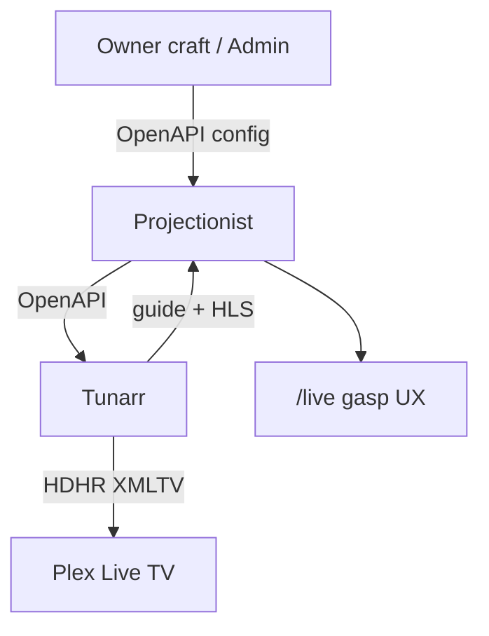

# Live Channels roadmap — craft + dual-surface watch

**Date:** 2026-07-30  
**Status:** Living scorecard (craft filters + exclusion + schedule-slots + pad/starters/sync **1.29.30**; full-run Shuffle + Chaos removed — **1.29.31**)  
**Audience:** Developers / agents shipping Live Channels  
**Source plan:** Cursor plan `coax_feature_audit_4055d8b6` (product intent only; no competitor framing)  
**Related:** [2026-07-29-live-channels-tunarr.md](./2026-07-29-live-channels-tunarr.md) · [spec](../specs/2026-07-29-live-channels-tunarr.md) · [deferred](./2026-07-29-live-channels-deferred.md)

---

## Product intent (locked)

| Decision | Choice |
|----------|--------|
| **Watch surfaces** | **Both first-class** — Projectionist `/live` **and** Plex Live TV (HDHR/XMLTV). Households pick the room/client. |
| **Projectionist watch** | Direct Tunarr HLS via auth’d proxy — not through Plex Web |
| **UX bar for `/live`** | Gasp-worthy fullscreen living-room chrome |
| **Broadcast engine** | Tunarr sibling (unchanged) |
| **Channel craft** | Collections, taste/motifs, Sequential / Shuffle, additive filters, continuity fillers, exclusion list |
| **Tunarr UI** | Never a supported owner workflow |

---

## Programming modes (lock)

| Mode | Intent | Loop / refill |
|------|--------|----------------|
| **Sequential** | Collection (or filter) order | Full resolved pool in order until refill |
| **Shuffle** | Randomize **within this station’s ID-resolved pool** | Full-run for collection/show (cap 1000); Tunarr `type=random` when pool supports it; else shuffled manual + Refill |

**Chaos removed (1.29.31):** not an owner mode. Legacy `chaos` station_meta / wire values normalize to Shuffle for one release.

---

## Scorecard

| Feature | Status | Notes |
|---------|--------|-------|
| Dual watch: Plex HDHR attach | **Done** | Keep |
| Dual watch: Projectionist `/live` gasp UX | **Done (1.29.26)** | Proxy + fullscreen + OSD + CC + EPG + pop-out |
| Collection publish: ratingKey → Tunarr IDs | **Done (1.29.25)** | Kill title-only primary path |
| Honest publish feedback (matched N/M · lineup K) | **Done (1.29.25)** | Not “real titles 1” (= stations) |
| Collection mode picker Sequential / Shuffle | **Done (1.29.25)**; Chaos removed **1.29.31** | Persist on `station_meta` |
| Async publish + in-block progress | **Done (1.29.25)** | Mirror continuity Repair |
| Refill reshuffles Shuffle from stored recipe | **Done (1.29.25)**; Chaos default removed **1.29.31** | Prefer stored recipe; underdefined → name-hint Shuffle |
| New channels in Plex without manual re-attach | **Done (1.29.25)** | Post-publish channelmap + `reloadGuide` |
| Channel logos Plex can fetch | **Done (1.29.25)** | LAN URL + per-station art + probe |
| Spec / HELP: dual watch; kill “does not play” | **Done (1.29.26)** | On-now CTA + `/live` nav when ready |
| Additive craft filters | **Done (1.29.30)** | genre ∩ decade ∩ motif/theme ∩ rating; preview; persist |
| Exclusion list (NoLive) | **Done (1.29.30)** | Skip during fill + starters |
| `schedule-slots` / cyclic shuffle | **Done (1.29.30)** | `type=random` programming + client; residual below |
| `pad_flex_max_minutes` UX + starter re-run | **Done (1.29.30)** | 0=back-to-back; additive starters; post-sync refresh |
| Full-run collection/show fill (not ~30) | **Done (1.29.31)** | Cap 1000; motif/taste soft default remains |
| Chaos removed from owner craft / starters | **Done (1.29.31)** | Legacy chaos → Shuffle alias |

---

## Residual limits (honest)

- Tunarr random slots schedule **movies** and **per-show** episode pools. A pool with neither movies nor `showId`s falls back to a shuffled **manual** lineup until Refill.
- `schedule-slots` client exists for preview/compute; publish prefers persisting `type=random` programming so Tunarr regenerates within `maxDays`.
- Motif/theme filters resolve via the Projectionist library index (ratingKeys); genre/decade/rating can also filter Tunarr catalog rows when IDs are unavailable.
- Motif / taste / filtered craft may still sample under a soft cap (~30–80); **collection/show full-run** (all resolved programs ≤ 1000) is the owner priority path.

---

## Delivery priority

0. Collection publish honesty + ID match + modes + async + refill recipe — **done 1.29.25**  
0b. Plex sync after publish + logos — **done 1.29.25**  
1. Revise product docs/spec (dual watch; gasp `/live`) — **done**  
2. `/live` MVP → gasp polish — **done 1.29.26**  
3. Additive craft filters (+ collection subfilter) — **done 1.29.30**  
4. Exclusion list — **done 1.29.30**  
5. `schedule-slots` / cyclic shuffle — **done 1.29.30**  
6. Pad UX + starter re-run + sync refresh — **done 1.29.30**  

---

## Verify (`/live` — 1.29.26)

1. **Nav:** With Live Channels enabled + Tunarr URL set, topbar shows **Live** after Explore.  
2. **Watch:** `/live` → Watch → HLS via `/api/live-channels/stream/…`. OSD + **C** for CC.  
3. **Guide:** Guide ↔ Watch; ↑↓←→ + Enter; youth rating gate.  
4. **Pop-out:** `/live/watch`; fluid resize; compact OSD under ~480px.  
5. **On now:** **Watch here** primary; **Also in Plex Live TV** secondary (persona UX Phase 1–2 glossary).  

## Verify (craft — 1.29.30 / full-run + no Chaos — 1.29.31)

1. **Additive filters:** Admin → Live Channels → Craft → pick Movies + genre Action + decade 1970s + a martial-arts theme → **Preview match count** → Publish. Success note shows matched N; Refill keeps the same filters from `station_meta`.  
2. **Exclusion:** Put a title in Plex collection **NoLive** (or rename under Schedule pad & exclusion). Publish/refill a filtered station — that title does not appear in the lineup.  
3. **Pad knob:** Set pad flex to **0**, Save → new publishes are back-to-back; set **15** for commercial-cut pads.  
4. **Starters:** Publish starters twice — second run skips existing numbers (additive). No Chaos proposal (**1.29.31**).  
5. **Sync refresh:** After library sync with Live Channels on, stations with stored recipes refill (status/summary may show `live_channels_refresh`).  
6. **Shuffle fidelity:** Publish Shuffle movie station → Tunarr programming is `type=random` when the pool has movies.  
7. **Full-run show (1.29.31):** Publish/refill a show collection (e.g. Gilligan’s Island) as Shuffle — lineup program count matches resolved episodes (≫ 30), not a 30-item loop. Admin craft has no Chaos option.  
