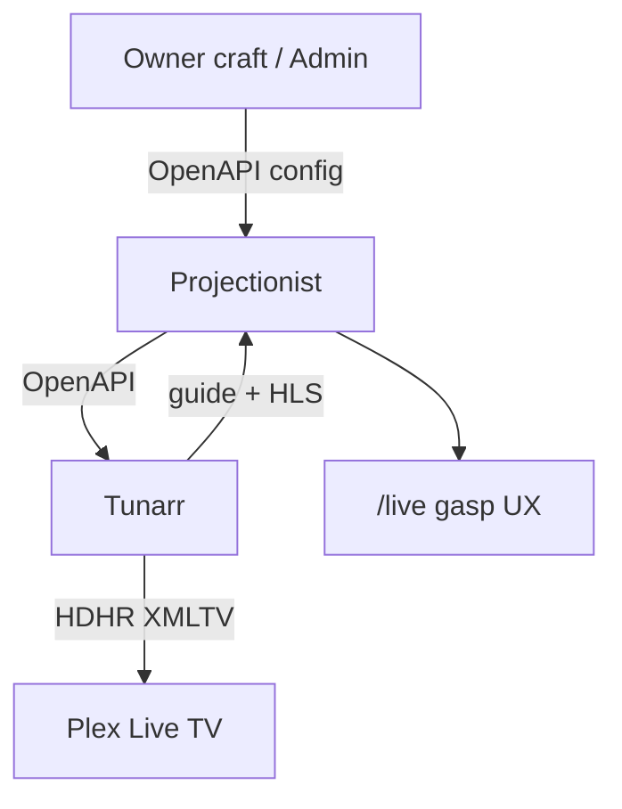

# Live Channels roadmap — craft + dual-surface watch

**Date:** 2026-07-30  
**Status:** Living scorecard (`/live` gasp UX shipped 1.29.26; craft gaps remain)  
**Audience:** Developers / agents shipping Live Channels  
**Source plan:** Cursor plan `coax_feature_audit_4055d8b6` (product intent only; no competitor framing)  
**Related:** [2026-07-29-live-channels-tunarr.md](./2026-07-29-live-channels-tunarr.md) · [spec](../specs/2026-07-29-live-channels-tunarr.md) · [deferred](./2026-07-29-live-channels-deferred.md)

---

## Product intent (locked)

| Decision | Choice |
|----------|--------|
| **Watch surfaces** | **Both first-class** — Projectionist `/live` **and** Plex Live TV (HDHR/XMLTV). Households pick the room/client. |
| **Projectionist watch** | Direct Tunarr HLS via auth’d proxy — not through Plex Web |
| **UX bar for `/live`** | Gasp-worthy fullscreen living-room chrome |
| **Broadcast engine** | Tunarr sibling (unchanged) |
| **Channel craft** | Collections, taste/motifs, Sequential / Shuffle / Chaos, additive filters, continuity fillers, exclusion list |
| **Tunarr UI** | Never a supported owner workflow |

---

## Programming modes (lock)

| Mode | Intent | Loop / refill |
|------|--------|----------------|
| **Sequential** | Collection (or filter) order | Same order until refill |
| **Shuffle** | Randomize **within this station’s ID-resolved pool** | Reshuffle same pool on Refill |
| **Chaos** | Wider entropy within `media_scope` (whole library types) | Reshuffle wider pool on Refill |

Today’s publish writes a finite manual lineup (~30 + flex). Tunarr replays that order until Refill / Repair. True mid-loop cyclic shuffle waits on Tunarr `schedule-slots`.

---

## Scorecard

| Feature | Status | Notes |
|---------|--------|-------|
| Dual watch: Plex HDHR attach | **Done** | Keep |
| Dual watch: Projectionist `/live` gasp UX | **Done (1.29.26)** | Proxy + fullscreen + OSD + CC + EPG + pop-out |
| Collection publish: ratingKey → Tunarr IDs | **Done (1.29.25)** | Kill title-only primary path |
| Honest publish feedback (matched N/M · lineup K) | **Done (1.29.25)** | Not “real titles 1” (= stations) |
| Collection mode picker seq/shuffle/chaos | **Done (1.29.25)** | Persist on `station_meta` |
| Async publish + in-block progress | **Done (1.29.25)** | Mirror continuity Repair |
| Refill reshuffles Shuffle/Chaos from stored recipe | **Done (1.29.25)** | Stop defaulting collection stations to Chaos |
| New channels in Plex without manual re-attach | **Done (1.29.25)** | Post-publish channelmap + `reloadGuide` |
| Channel logos Plex can fetch | **Done (1.29.25)** | LAN URL + per-station art + probe |
| Spec / HELP: dual watch; kill “does not play” | **Done (1.29.26)** | On-now CTA + `/live` nav when ready |
| Additive craft filters | **Gap** | genre ∩ decade ∩ motif |
| Exclusion list (NoLive) | **Gap** | |
| `schedule-slots` / cyclic shuffle | **Gap** | Continuous reshuffle |
| `pad_flex_max_minutes` UX + starter re-run | **Gap** / Partial | Continuity fillers shipped 1.29.24 |

---

## Delivery priority

0. Collection publish honesty + ID match + modes + async + refill recipe — **done 1.29.25**  
0b. Plex sync after publish + logos — **done 1.29.25**  
1. Revise product docs/spec (dual watch; gasp `/live`) — **done**  
2. `/live` MVP → gasp polish (proxy, fullscreen, OSD, CC, newspaper EPG, pop-out) — **done 1.29.26**  
3. Additive craft filters (+ collection subfilter)  
4. Exclusion list  
5. `schedule-slots` / cyclic shuffle  
6. Pad UX + starter re-run + sync refresh  

---

## Verify (`/live` — 1.29.26)

1. **Nav:** With Live Channels enabled + Tunarr URL set, topbar shows **Live** after Explore.  
2. **Watch:** `/live` → Watch (or click a guide cell) → fullscreen-capable HLS via `/api/live-channels/stream/…` (no Tunarr host in the browser Network panel). Mouse/focus reveals cable-box OSD; idle hides it. **C** opens CC picker (honest empty if none).  
3. **Guide:** Guide ↔ Watch toggle; ↑↓←→ + Enter tune; youth rating gate hides over-limit rows.  
4. **Pop-out:** **Pop out** opens `/live/watch`; resize stays `object-fit: contain`; compact OSD under ~480px.  
5. **On now:** Primary CTA **Watch in Projectionist**; secondary **Open in Plex Live TV**.  

## Verify (hot fixes — 1.29.25)

1. **Collection publish:** Admin → Live Channels → From a collection → pick Sequential / Shuffle / Chaos → Publish. Progress bar advances; success says `matched N/M · lineup K programs` (not “real titles 1”).  
2. **Plex new channel:** After publish, Plex Live TV listing shows the new number without Repair / re-attach (in-block: “Mapped N channels in Plex”).  
3. **Logos:** Station icon URL is LAN-reachable; collection/motif stations prefer title/collection art when available; Admin status can show icon reachability.  
4. **Refill:** Collection station Refill keeps Sequential/Shuffle/Chaos from `station_meta` (not forced Chaos).  
