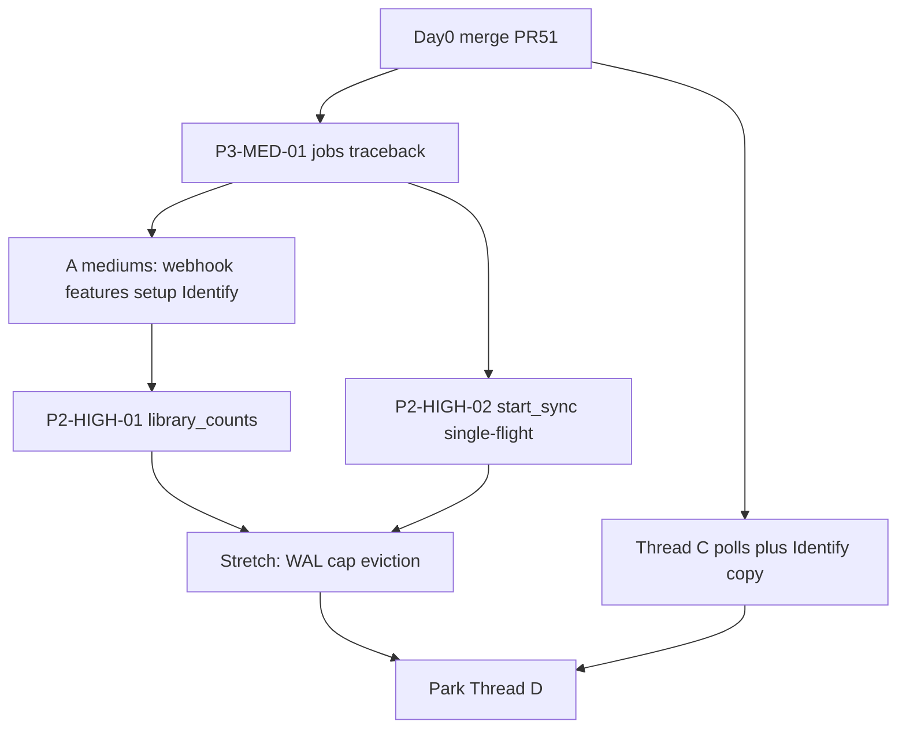

# Post-1.36.2 Hardening Implementation Plan

> **For agentic workers:** REQUIRED SUB-SKILL: Use superpowers:subagent-driven-development (recommended) or superpowers:executing-plans to implement this plan task-by-task. Steps use checkbox (`- [ ]`) syntax for tracking.

**Goal:** Close leftover perimeter, poll, and storage findings on `origin/release/1.36` after Automat **1.36.2**, without Hub/prod rollout unless asked.

**Architecture:** One hardening sprint, not a new Delight phase. Thread A finishes remaining Medium perimeter work (jobs traceback first — it locks `jobs.py`). Thread C runs in parallel on frontend polls and Identify honesty copy. Thread B Highs wait until A releases `jobs.py`, then `library_stats` COUNT and `start_sync` single-flight land, with WAL/cap/eviction as stretch. Thread D, AGPL #42, Hub, and Automat stay parked.

**Tech Stack:** Python 3.12 FastAPI, SQLite/WAL, React SPA (`frontend/src`), pytest, frontend `node --test` on `frontend/src/lib/*.test.mjs`. Source of truth for tickets: [docs/review-findings-25sept2026.md](../../review-findings-25sept2026.md).

**Authoritative tree at Day 0:** `origin/release/1.36` @ `6294b41e8917648b5fce9648ddae69e452d75de1` (merge of [PR #51](https://github.com/romwil/projectionist/pull/51)). Line numbers below were verified on that tree; rebase if a sibling already moved them.

## Global Constraints

- Branch: `release/1.36`. Tags live here, not `main`.
- File-lock before editing. `jobs.py`: A traceback (Task 1) before B `start_sync` (Task 8), or one owner lands both. Thread D waits until A/B clear `projectionist/web/app.py` and `projectionist/web/jobs.py`.
- Keep cookie `curatorx_session` and compose/CA `${CURATORX_*}` twins. Do not restore `X-CuratorX-Webhook-Secret`.
- HDMI/kiosk: idle poll backoff **8–10s even when `document.hidden` is unreliable**. WAL close is `PRAGMA wal_checkpoint(PASSIVE)` only — never `TRUNCATE`.
- UI proof QA `:8792` only. Never prod `:8788`, never smartmap `:8790`. Never Repair Plex. Never Apply Investigate on live household files.
- Defensive security only. New frontend tests: semantic locators. `clear_rate_limits()` in auth-heavy suites.
- Do not couple AGPL ([PR #42](https://github.com/romwil/projectionist/pull/42)), Hub `docker-release.sh`, QA `:8792` campaign, or Automat `rollout.sh` to this sprint.
- CHANGELOG under **Unreleased**. Do not bump 1.36.3 unless asked to ship. Update findings-file checkboxes when a finding lands.
- One PR per thread slice is fine (A mediums can be one PR after traceback lands, or traceback solo then the rest).



**Already shipped (do not redo):** Thread A Highs P3-HIGH-01/02/03 and chat POST (P4-HIGH-01 + P3-MED-02) in 1.36.1; TV/movie rw mounts + Investigate path map in 1.36.2. DashboardPage axe nit was a false positive.

**Sibling file locks while this sprint is in flight:** Thread A owns `projectionist/web/jobs.py` (traceback), `webhooks.py`, `app.py` `_features_payload`, `setup_routes.py`, `investigate_routes.py`. Thread C owns `frontend/src/pages/ConfigPage.jsx`, `frontend/src/App.jsx`, `frontend/src/pages/admin/LibrariesSection.jsx`. Do not edit a locked file from another thread.

---

### Task 0: Day 0 — merge PR #51

**Files:**
- Merged: `frontend/src/lib/backNav.js` (`savedLibraryChatHref`)
- Merged: `frontend/src/components/ChatWorkspace.jsx`, `frontend/src/pages/LibraryPage.jsx`
- Merged: `frontend/src/lib/backNav.test.mjs`, `frontend/src/lib/chatLayout.test.mjs`

**Why:** Saved-library chips went to `/?saved_library=…`. `frontend/src/AppRoutes.jsx` maps `/` to `<Navigate to="/chat" replace />` and drops the query. PR retargets `/chat?saved_library=…` (plus Library “Chat from here” / follow-ups).

- [x] **Step 1: Confirm mergeable and run focused tests**

Focused (no full e2e):

```bash
cd frontend && node --test src/lib/backNav.test.mjs src/lib/chatLayout.test.mjs
```

Expected: 41 passed, 0 failed.

- [x] **Step 2: Merge into `release/1.36`**

Merged as [PR #51](https://github.com/romwil/projectionist/pull/51). Merge SHA: `6294b41e8917648b5fce9648ddae69e452d75de1`. No Hub. No prod. Leave [AGPL #42](https://github.com/romwil/projectionist/pull/42) open.

- [ ] **Step 3: Move the CHANGELOG chip line to Unreleased**

GitHub’s 3-way merge placed the Fixed line under shipped **1.36.2**. It belongs under `## [Unreleased]`. Do not rewrite 1.36.2 Highlights/Verification.

- [ ] **Step 4: Note leftover (do not fix in this task)**

Bugbot: `savedLibraryStartedRef` in `frontend/src/App.jsx` (~1108–1111) stays true after the first `/chat?saved_library=` consume, so a second shelf tap on chat home is a no-op. Thread C owns `App.jsx` — park unless C picks it up.

---

### Task 1: P3-MED-01 — strip traceback from `jobs.py` `_run_sync` (locks `jobs.py`)

**Files:**
- Modify: `projectionist/web/jobs.py:377` (`_run_sync` except)
- Test: `tests/test_durable_jobs.py` (extend) or a focused new case in that file

**Interfaces:**
- Consumes: `friendly_job_error(error)` already assigned to `job.error`; `logger.exception` already server-side
- Produces: failed `Job.summary == {"failed": True}`; `Job.to_dict()` must never contain a `traceback` key or frame strings

- [ ] **Step 1: Write the failing test**

Add to `tests/test_durable_jobs.py`:

```python
def test_failed_sync_summary_has_no_traceback(self) -> None:
    manager = JobManager(self.data_dir)
    settings = MagicMock()
    with patch("projectionist.web.jobs.sync_library", side_effect=RuntimeError("boom")):
        job = manager.start_sync(settings)
        deadline = time.time() + 5
        while time.time() < deadline:
            current = manager.get_job(job.id)
            if current and current.status == "failed":
                break
            time.sleep(0.05)
        else:
            self.fail("sync job did not fail in time")
    payload = current.to_dict()
    self.assertEqual(payload["summary"], {"failed": True})
    self.assertNotIn("traceback", payload["summary"])
    blob = json.dumps(payload)
    self.assertNotIn("Traceback", blob)
    self.assertNotIn("jobs.py", blob)
    self.assertTrue(payload["error"])
    self.assertNotIn("Traceback", payload["error"])
```

- [ ] **Step 2: Run test to verify it fails**

```bash
.venv/bin/python -m pytest tests/test_durable_jobs.py::DurableJobsTests::test_failed_sync_summary_has_no_traceback -v
```

Expected: FAIL because `job.summary` still stores `traceback.format_exc()`.

- [ ] **Step 3: Write minimal implementation**

In `projectionist/web/jobs.py` `_run_sync` except (`:369-378`), replace the summary assignment only:

```python
        except Exception as error:  # noqa: BLE001
            logger.exception("Library sync failed job_id=%s: %s", job_id, error)
            self._progress_log_at.pop(job_id, None)
            self._progress_log_phase.pop(job_id, None)
            with self._lock:
                job.status = "failed"
                job.finished_at = time.time()
                job.error = friendly_job_error(error)
                job.summary = {"failed": True}
                self._persist_locked()
```

Do not put traceback on `job.error`. Do not change `Job.to_dict()` to filter keys as a substitute — never write traceback into `summary` in the first place. `logger.exception` stays.

- [ ] **Step 4: Run test to verify it passes**

```bash
.venv/bin/python -m pytest tests/test_durable_jobs.py -v
```

Expected: PASS. Then CHANGELOG Unreleased + mark P3-MED-01 done in `docs/review-findings-25sept2026.md`.

- [ ] **Step 5: Commit**

```bash
git add projectionist/web/jobs.py tests/test_durable_jobs.py CHANGELOG.md docs/review-findings-25sept2026.md
git commit -m "$(cat <<'EOF'
Hide failed library-sync tracebacks from GET /api/jobs.

EOF
)"
```

**Lock release:** Thread B may take `jobs.py` after this commit is on `release/1.36`.

---

### Task 2: P3-MED-03 — webhook digest length-stable

**Files:**
- Modify: `projectionist/web/webhooks.py:179`
- Test: `tests/test_webhooks.py` (`PlexWebhookApiTests`)

**Interfaces:**
- Consumes: `settings.webhook_secret`; header `X-Projectionist-Webhook-Secret`
- Produces: 401 (never 500) when secret/provided missing or lengths differ; SHA-256 of both sides so `secrets.compare_digest` is fixed-length

- [ ] **Step 1: Write the failing test**

```python
    def test_mismatched_secret_lengths_are_401_not_500(self) -> None:
        response = self.client.post(
            "/api/webhooks/plex",
            json=_movie_stop_payload(),
            headers={"X-Projectionist-Webhook-Secret": "x"},
        )
        self.assertEqual(response.status_code, 401)
        self.assertNotEqual(response.status_code, 500)
```

Also cover empty provided and empty configured secret → 401.

- [ ] **Step 2: Run test to verify it fails**

```bash
.venv/bin/python -m pytest tests/test_webhooks.py::PlexWebhookApiTests::test_mismatched_secret_lengths_are_401_not_500 -v
```

Expected: FAIL with 500 if `compare_digest` raises on length mismatch (or xfail-on-equal-length current secret). Use a provided value whose length ≠ `self._secret`.

- [ ] **Step 3: Write minimal implementation**

Replace the compare at `webhooks.py:176-180`:

```python
        secret = str(settings.webhook_secret or "").strip()
        provided = str(request.headers.get("X-Projectionist-Webhook-Secret") or "").strip()
        if not secret or not provided:
            raise HTTPException(status_code=401, detail="Unauthorized")
        secret_digest = hashlib.sha256(secret.encode("utf-8")).digest()
        provided_digest = hashlib.sha256(provided.encode("utf-8")).digest()
        if not secrets.compare_digest(provided_digest, secret_digest):
            raise HTTPException(status_code=401, detail="Unauthorized")
```

Keep `X-Projectionist-Webhook-Secret`. Do not restore `X-CuratorX-Webhook-Secret`. Add `import hashlib` if missing.

- [ ] **Step 4: Run tests**

```bash
.venv/bin/python -m pytest tests/test_webhooks.py tests/test_rebrand_compat.py -v
```

Expected: PASS. CHANGELOG Unreleased. Mark P3-MED-03 done in the findings file.

- [ ] **Step 5: Commit**

```bash
git add projectionist/web/webhooks.py tests/test_webhooks.py CHANGELOG.md docs/review-findings-25sept2026.md
git commit -m "$(cat <<'EOF'
Compare webhook secrets as SHA-256 so length mismatch is 401.

EOF
)"
```

---

### Task 3: P4-MED-01 — shrink unauthenticated `/api/features`

**Files:**
- Modify: `projectionist/web/app.py:1176` `_features_payload`
- Test: existing features/authz suite (prefer `tests/test_api_authz.py` or `tests/test_setup_mode.py`); `clear_rate_limits()` if the suite hits auth routes

**Interfaces:**
- Consumes: `authenticated: bool`, optional `user`
- Produces: when `authenticated=False`, **only** `features.multi_user_enabled`, `auth_methods`, `setup_state`, `authenticated: false`, `user: null`

- [ ] **Step 1: Write the failing test**

Add next to `ApiAuthzTests.test_public_allowlist_stays_open` in `tests/test_api_authz.py` (that case already does `self.client.cookies.clear()` + `GET /api/features`):

```python
    def test_unauthenticated_features_omits_topology(self) -> None:
        self._write_multi_user_settings()
        self.client.cookies.clear()
        response = self.client.get("/api/features")
        self.assertEqual(response.status_code, 200)
        body = response.json()
        self.assertFalse(body["authenticated"])
        self.assertIsNone(body["user"])
        self.assertEqual(set(body["features"]), {"multi_user_enabled"})
        self.assertIn("auth_methods", body)
        self.assertIn("setup_state", body)
        for key in (
            "household_domain",
            "seerr",
            "youth",
            "notifications",
            "request_path",
            "auth",
        ):
            self.assertNotIn(key, body)
        self.assertNotIn("live_channels_ready", body["features"])
        self.assertNotIn("trust_proxy_headers", body["features"])
        self.assertNotIn("seerr_enabled", body["features"])
```

`setUp`/`tearDown` already call `clear_rate_limits()`. Unauthenticated `GET /api/features` must not emit `household_domain`, `live_channels_ready`, `trust_proxy_headers`, Seerr flags, or `youth.max_content_rating`.

- [ ] **Step 2: Run test to verify it fails**

```bash
.venv/bin/python -m pytest tests/test_api_authz.py -k unauthenticated_features -v
```

Expected: FAIL — current `_features_payload` still emits topology when `authenticated=False` (`app.py:1254-1262` still sets `youth.max_content_rating`).

- [ ] **Step 3: Write minimal implementation**

Early-return when unauthenticated, **before** building the full payload (do not compute Seerr/Tunarr/youth for anonymous):

```python
def _features_payload(user=None, *, authenticated: bool = True) -> Dict[str, Any]:
    settings = _settings()
    from projectionist.web.setup_mode import resolve_setup_state

    if not authenticated:
        return {
            "features": {
                "multi_user_enabled": settings.features.multi_user_enabled,
            },
            "auth_methods": available_auth_methods(settings),
            "setup_state": resolve_setup_state(_db()),
            "authenticated": False,
            "user": None,
        }
    # existing authenticated payload unchanged
```

Do not change the authenticated shape. Members still get readiness from this endpoint when signed in.

- [ ] **Step 4: Run tests**

```bash
.venv/bin/python -m pytest tests/test_api_authz.py tests/test_setup_mode.py tests/test_live_channels_api.py -q
```

Expected: PASS. Existing live-channels tests that read `features.live_channels_ready` must use an authenticated client. CHANGELOG Unreleased. Mark P4-MED-01 done.

- [ ] **Step 5: Commit**

```bash
git add projectionist/web/app.py tests/test_api_authz.py CHANGELOG.md docs/review-findings-25sept2026.md
git commit -m "$(cat <<'EOF'
Omit household topology from unauthenticated GET /api/features.

EOF
)"
```

---

### Task 4: P4-MED-04 — owner-gate `/api/setup/status`

**Files:**
- Modify: `projectionist/web/setup_routes.py:67-69`
- Test: `tests/test_api_authz.py` or `tests/test_setup_mode.py`; update `tests/test_api_contract.py` / `tests/test_h1_shell_extract.py` if they called status without an owner session

**Interfaces:**
- Consumes: `require_role("owner")` (already imported/used on other setup routes)
- Produces: member/unauth → 403; owner → 200 `build_setup_status(...)`. Members already get readiness from `/api/features`.

- [ ] **Step 1: Write the failing test**

Add to `ApiAuthzTests` using the existing `_enable_multi_user_via_api` + `_login_as` helpers (`tests/test_api_authz.py:72-88`):

```python
    def test_setup_status_requires_owner(self) -> None:
        self._enable_multi_user_via_api()
        self.client.cookies.clear()
        unauth = self.client.get("/api/setup/status")
        self.assertEqual(unauth.status_code, 403)
        self._login_as(1, "Owner")
        self.client.post("/api/auth/logout")
        self._login_as(2, "Member")
        member = self.client.get("/api/setup/status")
        self.assertEqual(member.status_code, 403)
        self.client.post("/api/auth/logout")
        self._login_as(1, "Owner")
        owner = self.client.get("/api/setup/status")
        self.assertEqual(owner.status_code, 200)
```

`clear_rate_limits()` is already in this suite’s `setUp`/`tearDown`.

- [ ] **Step 2: Run test to verify it fails**

```bash
.venv/bin/python -m pytest tests/test_api_authz.py -k setup_status_requires_owner -v
```

Expected: FAIL — current handler has no `Depends(require_role)`.

- [ ] **Step 3: Write minimal implementation**

```python
    @router.get("/api/setup/status")
    def setup_status(user=Depends(require_role("owner"))) -> Dict[str, Any]:
        del user
        return build_setup_status(_settings(), _db())
```

- [ ] **Step 4: Run tests**

```bash
.venv/bin/python -m pytest tests/test_api_authz.py tests/test_api_contract.py tests/test_h1_shell_extract.py tests/test_setup_mode.py -q
```

Expected: PASS after contract/extract tests sign in as owner. CHANGELOG Unreleased. Mark P4-MED-04 done.

- [ ] **Step 5: Commit**

```bash
git add projectionist/web/setup_routes.py tests/ CHANGELOG.md docs/review-findings-25sept2026.md
git commit -m "$(cat <<'EOF'
Require an owner session for GET /api/setup/status.

EOF
)"
```

---

### Task 5: P3-MED-04 — Identify test path roots

**Files:**
- Modify: `projectionist/web/investigate_routes.py:242-250` (`identify_test`)
- Test: `tests/test_episode_investigate.py` or the admin Identify API suite if one exists

**Interfaces:**
- Consumes: `IdentifyTestPayload.path`, `payload.file_id`; configured media roots (Plex section paths / Radarr/Sonarr / `tv_root`/`movies_root` / `/tv` `/movies`)
- Produces: reject unless `resolved.is_relative_to(root)` → 400 or 403; `file_id` still resolves from snapshot row; ignore raw `path` unless it matches a snapshot row. Owner-session only (already `require_role("owner")`). Keep test `renamed: False`.

- [ ] **Step 1: Write the failing test**

Owner session via `ApiAuthzTests._login_as(1, "Owner")` (or the Investigate API suite’s existing owner client). Path must be a real file outside media roots:

```python
    def test_identify_test_rejects_path_outside_media_roots(self) -> None:
        outside = Path(self._tmpdir.name) / "not-media" / "clip.mkv"
        outside.parent.mkdir(parents=True)
        outside.write_bytes(b"x")
        self._enable_multi_user_via_api()
        self._login_as(1, "Owner")
        response = self.client.post(
            "/api/admin/investigate/identify/test",
            json={"path": str(outside)},
        )
        self.assertIn(response.status_code, {400, 403})
        self.assertFalse(response.json().get("renamed", False))
```

Also: in-root path or snapshot `file_id` still returns a test snap. No exploit write-up. No payload that teaches a bypass.

- [ ] **Step 2: Run test to verify it fails**

```bash
.venv/bin/python -m pytest tests/test_episode_investigate.py -k identify_test_rejects_path_outside -v
```

Expected: FAIL — raw readable `payload.path` currently goes straight to `test_identify_clip`.

- [ ] **Step 3: Write minimal implementation**

Resolve `path` against configured roots. Reject unless the resolved path is under a root. If only `file_id`, keep snapshot-row resolve. Ignore raw `path` unless it matches a snapshot row.

```python
    path = str(payload.path or "").strip()
    if payload.file_id:
        snap = build_status()
        result = snap.get("result") if isinstance(snap.get("result"), dict) else {}
        snapshot_path = ""
        for row in result.get("rows") or []:
            if str(row.get("id") or "") == str(payload.file_id):
                snapshot_path = str(row.get("path") or "")
                break
        if not snapshot_path:
            raise HTTPException(status_code=400, detail="Unknown identify file")
        if path and Path(path).resolve() != Path(snapshot_path).resolve():
            raise HTTPException(status_code=400, detail="Path does not match snapshot")
        path = snapshot_path
    resolved = Path(path).expanduser().resolve()
    if not any(resolved.is_relative_to(root) for root in _identify_media_roots(_settings())):
        raise HTTPException(status_code=403, detail="Path is outside configured media roots")
```

Reuse the existing Investigate path-map roots (Plex sections, Radarr/Sonarr, `tv_root`/`movies_root`, `/tv`, `/movies`). Do not add a second root list. Owner-session only.

- [ ] **Step 4: Run tests**

```bash
.venv/bin/python -m pytest tests/test_episode_investigate.py -q
```

Expected: PASS. CHANGELOG Unreleased. Mark P3-MED-04 done.

- [ ] **Step 5: Commit**

```bash
git add projectionist/web/investigate_routes.py tests/test_episode_investigate.py CHANGELOG.md docs/review-findings-25sept2026.md
git commit -m "$(cat <<'EOF'
Reject Identify test paths that are outside configured media roots.

EOF
)"
```

---

### Task 6: P2-HIGH-03 — poll only the visible busy section (Thread C)

**Files:**
- Modify: `frontend/src/pages/ConfigPage.jsx:835` (sync jobs 2s on all `/admin/*`), `:856` (Sonarr missing 2s), `:887` (Radarr register 2s). Live `:707` is already gated.
- Modify: `frontend/src/pages/admin/LibrariesSection.jsx:618` (Investigate 2s forever)
- Modify: `frontend/src/App.jsx:747` (`listJobs` every 5s forever)
- Create: `frontend/src/lib/visibleBusyPoll.js` + `frontend/src/lib/visibleBusyPoll.test.mjs`

**Interfaces:**
- Consumes: section visibility, busy flag, `document.hidden`
- Produces: `idlePollMs()` ≥ 8000 and ≤ 10000; hidden pauses as extra, **not** sufficient; drop chat-shell `listJobs` unless a sync toast is open

HDMI / kiosk Chromium often will not fire `document.hidden` on standby. Idle backoff is **8–10s even when visibility is unreliable**.

- [ ] **Step 1: Write the failing test**

```javascript
import assert from "node:assert/strict";
import { describe, it } from "node:test";
import { idlePollMs, shouldPoll } from "./visibleBusyPoll.js";

describe("visible busy poll", () => {
  it("backs off to 8–10s when idle even if hidden is false", () => {
    assert.ok(idlePollMs({ busy: false, hidden: false }) >= 8000);
    assert.ok(idlePollMs({ busy: false, hidden: false }) <= 10000);
    assert.equal(shouldPoll({ visibleSection: false, busy: true, hidden: false }), false);
    assert.equal(shouldPoll({ visibleSection: true, busy: false, hidden: true }), false);
  });
});
```

No mocked `setBusy` spies. Targeted Playwright only if a job toast is already covered — no full e2e suite.

- [ ] **Step 2: Run test to verify it fails**

```bash
cd frontend && node --test src/lib/visibleBusyPoll.test.mjs
```

Expected: FAIL — module does not exist yet.

- [ ] **Step 3: Write minimal implementation**

```javascript
export const IDLE_POLL_MS = 8000;
export const BUSY_POLL_MS = 2000;

export function idlePollMs({ busy, hidden }) {
  if (hidden) return null;
  return busy ? BUSY_POLL_MS : IDLE_POLL_MS;
}

export function shouldPoll({ visibleSection, busy, hidden }) {
  if (!visibleSection || hidden) return false;
  return true;
}
```

Wire Config / Libraries / App to poll only the visible section, only while busy, backoff 8–10s when idle, pause on `document.hidden` as extra. Drop chat-shell `listJobs` unless a sync toast is open.

- [ ] **Step 4: Run tests**

```bash
cd frontend && node --test src/lib/visibleBusyPoll.test.mjs
```

Expected: PASS. CHANGELOG Unreleased. Mark P2-HIGH-03 done.

- [ ] **Step 5: Commit**

```bash
git add frontend/src/lib/visibleBusyPoll.js frontend/src/lib/visibleBusyPoll.test.mjs \
  frontend/src/pages/ConfigPage.jsx frontend/src/pages/admin/LibrariesSection.jsx frontend/src/App.jsx \
  CHANGELOG.md docs/review-findings-25sept2026.md
git commit -m "$(cat <<'EOF'
Poll admin jobs only while the section is visible and busy.

EOF
)"
```

---

### Task 7: P4-MED-03 — Identify leaves-the-LAN copy (Thread C)

**Files:**
- Modify: `frontend/src/lib/episodeInvestigate.js:3-4` (add `IDENTIFY_LEAVES_LAN` next to `STILLS_LEAVE_LAN`)
- Modify: Identify settings + test controls in `frontend/src/pages/admin/LibrariesSection.jsx` (Thread C lock)
- Test: `frontend/src/lib/episodeInvestigate.test.mjs`

**Interfaces:**
- Consumes: `IDENTIFY_CLIP_SECONDS = 12.0` from `projectionist/library/episode_investigate/ffmpeg.py:113`
- Produces: owner-facing sentence that a 12s clip leaves the LAN; a miss does not rename. Keep test `renamed: False`.

- [ ] **Step 1: Write the failing test**

Extend `frontend/src/lib/episodeInvestigate.test.mjs`:

```javascript
it("warns that Identify clips leave the LAN and a miss does not rename", () => {
  assert.match(IDENTIFY_LEAVES_LAN, /12/);
  assert.match(IDENTIFY_LEAVES_LAN, /does not rename/i);
  assert.match(IDENTIFY_LEAVES_LAN, /LAN/);
});
```

- [ ] **Step 2: Run test to verify it fails**

```bash
cd frontend && node --test src/lib/episodeInvestigate.test.mjs
```

Expected: FAIL — `IDENTIFY_LEAVES_LAN` is not exported.

- [ ] **Step 3: Write minimal implementation**

```javascript
export const IDENTIFY_LEAVES_LAN =
  "Identify sends a 12-second clip off the LAN. A miss does not rename the file.";
```

Surface on Identify settings + test controls next to the existing stills sentence. Do not change ACRCloud host allowlist or key masking.

- [ ] **Step 4: Run tests**

```bash
cd frontend && node --test src/lib/episodeInvestigate.test.mjs
```

Expected: PASS. CHANGELOG Unreleased. Mark P4-MED-03 done.

- [ ] **Step 5: Commit**

```bash
git add frontend/src/lib/episodeInvestigate.js frontend/src/lib/episodeInvestigate.test.mjs \
  frontend/src/pages/admin/LibrariesSection.jsx CHANGELOG.md docs/review-findings-25sept2026.md
git commit -m "$(cat <<'EOF'
Tell owners Identify clips leave the LAN and a miss does not rename.

EOF
)"
```

---

### Task 8: P2-HIGH-01 — `library_stats` via `library_counts()` (Thread B, after Task 1)

**Files:**
- Modify: `projectionist/web/app.py:1377-1382` (`library_stats`)
- Reuse: `projectionist/library/db/_library_query.py:156` `library_counts()` → `{"movies", "shows", "items"}`
- Test: stats unit that spies `library_counts` or asserts SQL COUNT (do not load every row)

**Interfaces:**
- Consumes: `db.library_counts()`
- Produces: `{ total: items, movies, shows, last_sync, plex_server_name, knowledge_coverage }` still passed through `_sanitize_library_payload`

- [ ] **Step 1: Write the failing test**

```python
    def test_library_stats_uses_library_counts(self) -> None:
        with patch.object(db, "library_counts", return_value={"movies": 2, "shows": 3, "items": 5}) as spy:
            with patch.object(db, "all_library_items") as all_items:
                body = self.client.get("/api/library/stats").json()
                spy.assert_called_once()
                all_items.assert_not_called()
        self.assertEqual(body["total"], 5)
        self.assertEqual(body["movies"], 2)
        self.assertEqual(body["shows"], 3)
```

Do not change other `all_library_items()` callers (feeds/facets).

- [ ] **Step 2: Run test to verify it fails**

```bash
.venv/bin/python -m pytest tests/test_api_authz.py -k library_stats_uses_library_counts -v
```

Expected: FAIL — current handler calls `db.all_library_items()` then counts in Python.

- [ ] **Step 3: Write minimal implementation**

```python
@app.get("/api/library/stats")
def library_stats(user=Depends(get_current_user_dep)) -> Dict[str, Any]:
    db = _db()
    counts = db.library_counts()
    settings = _settings()
    plex_server_name = ""
    if settings.plex_url and settings.plex_token:
        plex_server_name = cached_plex_friendly_name(settings.plex_url, settings.plex_token, timeout=5)
    payload = {
        "total": counts["items"],
        "movies": counts["movies"],
        "shows": counts["shows"],
        "last_sync": db.get_sync_state("last_sync"),
        "plex_server_name": plex_server_name or None,
        "knowledge_coverage": compute_knowledge_coverage(db),
    }
```

Keep `_sanitize_library_payload`. Helper name is `library_counts()` — not `library_item_counts`.

- [ ] **Step 4: Run tests**

```bash
.venv/bin/python -m pytest tests/test_api_authz.py -k library_stats -q
```

Expected: PASS. CHANGELOG Unreleased. Mark P2-HIGH-01 done.

- [ ] **Step 5: Commit**

```bash
git add projectionist/web/app.py tests/ CHANGELOG.md docs/review-findings-25sept2026.md
git commit -m "$(cat <<'EOF'
Serve library stats from SQL COUNT instead of loading every row.

EOF
)"
```

---

### Task 9: P2-HIGH-02 — single-flight `start_sync` (Thread B, after Task 1)

**Files:**
- Modify: `projectionist/web/jobs.py:173-182` (`JobManager.start_sync`)
- Test: `tests/test_durable_jobs.py`

**Interfaces:**
- Consumes: `_lock`, existing `library_sync` jobs in `queued`/`running`
- Produces: second `POST /api/library/sync` returns the existing job (200) or 409 — match Sonarr-missing / `admin_execution.store.begin`. Scheduler already refuses a second run at `jobs.py:422-423`.

- [ ] **Step 1: Write the failing test**

```python
    def test_start_sync_is_single_flight(self) -> None:
        manager = JobManager(self.data_dir)
        settings = MagicMock()
        with patch("projectionist.web.jobs.sync_library", side_effect=lambda *a, **k: time.sleep(2) or {"movies": 0, "shows": 0}):
            first = manager.start_sync(settings)
            second = manager.start_sync(settings)
        self.assertEqual(first.id, second.id)
        running = [j for j in manager.list_jobs() if j.job_type == "library_sync" and j.status in {"queued", "running"}]
        self.assertEqual(len(running), 1)
```

Also: two HTTP `POST /api/library/sync` → one running job.

- [ ] **Step 2: Run test to verify it fails**

```bash
.venv/bin/python -m pytest tests/test_durable_jobs.py::DurableJobsTests::test_start_sync_is_single_flight -v
```

Expected: FAIL — every call starts a new UUID + thread.

- [ ] **Step 3: Write minimal implementation**

```python
    def start_sync(self, settings: Settings) -> Job:
        with self._lock:
            for existing in self._jobs.values():
                if existing.job_type == "library_sync" and existing.status in {"queued", "running"}:
                    return existing
            job_id = uuid.uuid4().hex[:12]
            job = Job(id=job_id, job_type="library_sync", status="queued", created_at=time.time())
            self._jobs[job_id] = job
            self._persist_locked()
        logger.info("Library sync job queued job_id=%s", job.id)
        thread = threading.Thread(target=self._run_sync, args=(job.id, settings), daemon=True)
        thread.start()
        return job
```

If the HTTP layer should 409 instead of 200-with-existing, match Sonarr-missing — do not invent a third contract.

- [ ] **Step 4: Run tests**

```bash
.venv/bin/python -m pytest tests/test_durable_jobs.py -v
```

Expected: PASS. CHANGELOG Unreleased. Mark P2-HIGH-02 done.

- [ ] **Step 5: Commit**

```bash
git add projectionist/web/jobs.py tests/test_durable_jobs.py CHANGELOG.md docs/review-findings-25sept2026.md
git commit -m "$(cat <<'EOF'
Reuse a queued or running library sync instead of starting a second thread.

EOF
)"
```

---

### Task 10: Week 2 stretch — WAL close, identified-keys cap, rate-limit eviction

Park whisper seed (P4-MED-02) if the week fills. Seed from `watch_tracker` / per-user view state only; never another member `last_viewed_at`.

#### 10a. WAL close

**Files:** `projectionist/library/db/_schema.py:71` `Database.close()`

- [ ] **Step 1: After serializer shutdown, checkpoint PASSIVE**

```python
    def close(self) -> None:
        serializer = getattr(self, "_write_serializer", None)
        if serializer is not None:
            serializer.shutdown()
        try:
            with self.connect() as conn:
                conn.execute("PRAGMA wal_checkpoint(PASSIVE)")
        except Exception:
            logger.exception("WAL PASSIVE checkpoint failed during Database.close")
```

Never `TRUNCATE`. Do not Repair Plex. Do not touch smartmap `:8790`.

- [ ] **Step 2: Test + commit**

Assert close issues `wal_checkpoint(PASSIVE)` and never `TRUNCATE`. CHANGELOG Unreleased.

#### 10b. P2-MED-01 — cap `_identified_keys`

**Files:** `projectionist/library/episode_investigate/acrcloud.py:52`

- [ ] **Step 1: `OrderedDict` cap 4096, evict oldest**

```python
from collections import OrderedDict

_IDENTIFIED_KEYS_MAX = 4096
_identified_keys: OrderedDict[str, None] = OrderedDict()
```

On claim, `pop` + reinsert, then while `len > 4096: popitem(last=False)`. Tests still call `reset_identify_throttle_for_tests`.

- [ ] **Step 2: Test + commit**

#### 10c. P2-MED-02 — evict rate-limit buckets

**Files:** `projectionist/web/rate_limit.py:19` `SlidingWindowRateLimiter.check`

- [ ] **Step 1: After `check()`, if `len(self._hits) > 4096`**

Drop empty-after-cutoff keys, else evict oldest stale buckets. Same lock.

- [ ] **Step 2: Test + commit**

---

### Task 11: PR / CHANGELOG / findings hygiene

- [ ] CHANGELOG stays under **Unreleased** for every task above. Do not bump 1.36.3 unless asked.
- [ ] Update `docs/review-findings-25sept2026.md` checkboxes/status when a finding lands so the register stays honest.
- [ ] One PR per thread slice is fine. Do not Hub-publish. Do not `rollout.sh`. Do not merge [AGPL #42](https://github.com/romwil/projectionist/pull/42).

---

## Parked (not this sprint)

- Thread D: `auth_routes` / `setup_routes` factory injection; carve `library_routes.py` / `chat_routes.py`; CuratorX user-visible strings; ConfigPage/App composition after C.
- AGPL #42 (MIT through 1.36.2).
- Hub `docker-release.sh`, QA `:8792` campaign, prod `rollout.sh`.
- Investigate Apply / rematch on live Automat library.
- Inventing Phase 7 / new Delight gifts.
- P4-MED-02 whisper seed if the week fills.
- Bugbot leftover from #51: second saved-library chip tap on `/chat` is a no-op (`savedLibraryStartedRef` in `App.jsx`).

## Execution handoff

Plan complete and saved to `docs/superpowers/plans/2026-09-27-post-136-hardening.md`.

Two execution options:

1. **Subagent-Driven (recommended)** — fresh subagent per remaining task (1–10), review between tasks. Thread A and Thread C may run in parallel after Task 0; Thread B waits for Task 1.
2. **Inline Execution** — execute in-session using executing-plans, batch with checkpoints.

Day 0 (Task 0) is done. Remaining work starts at Task 1 (A, locks `jobs.py`) and Task 6 (C, frontend only).
