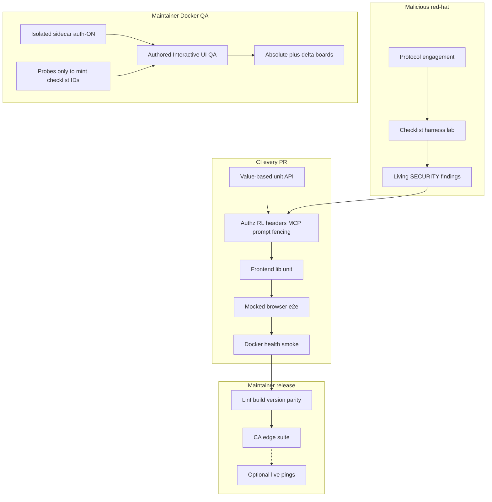

# Cursor QA environment design (product-agnostic)

**Status:** Standalone design extract  
**Date:** 2026-07-29  
**Audience:** Cursor agents and maintainers standing up CI + maintainer QA + red-hat pentest in **any** self-hosted or full-stack product repo.

This document is a **Cursor-ready, product-agnostic** design for a layered testing environment. It is derived from a worked feature-testing blueprint; product inventory, ports, gap matrices, and backlog items are intentionally omitted so another Cursor project can implement from placeholders alone.

**Placeholder convention:** `{CURLY}` names. Substitute before implementing. Do not treat any numeric port, hostname, brand, or host path in other repos as normative here.

---

## 0. How to use this doc in Cursor

1. Copy this file (or link it) into the **target** repo under `docs/superpowers/specs/` (or equivalent).
2. Fill the [placeholder registry](#01-placeholder-registry) for `{APP_NAME}`.
3. Treat **that repo** as the authority — see [§2](#2-repo-as-authority-surface-inventory--qa-patterns). Do not invent journeys from imagination or another product’s checklists.
4. Run the [surface inventory procedure](#23-procedure-survey--inventory--derive-patterns); mark required vs optional layers for product maturity.
5. Follow the [standing-up playbook](#10-copy-vs-invent--standing-up-playbook) in order.
6. Create the [Cursor artifacts](#11-cursor-artifacts-to-create) in the same change set as the first CI skeleton.
7. Expand checklist IDs and pentest cases from the inventory as surfaces ship — never as free-form click-around campaigns.

---

## 0.1 Placeholder registry

| Placeholder | Meaning | Typical substitute shape |
|-------------|---------|--------------------------|
| `{APP_NAME}` | Product display / package name | string |
| `{PROD_PORT}` | Production / Docker host map / tunnel trap | integer port |
| `{E2E_PORT}` | Temp mocked Playwright (or equivalent) server | integer ≠ `{PROD_PORT}` |
| `{QA_PORT}` | Maintainer auth-ON Docker QA sidecar | integer ≠ `{PROD_PORT}`, ≠ `{E2E_PORT}` |
| `{DATA_DIR}` | App state root (DB, settings, secrets at rest) | path env |
| `{HEALTH_PATH}` | Liveness HTTP path | e.g. `/api/health` |
| `{COV_FAIL_UNDER}` | Enforced coverage floor | integer % |
| `{TRUST_PROXY_ENV}` | Env that enables trusting `X-Forwarded-*` | env name |
| `{ROLE_MATRIX}` | Seeded QA roles | e.g. owner / member / youth / guest / guest-tour |
| `{QA_RUNS_DIR}` | Host-local Interactive UI QA artifacts (gitignored) | absolute path outside product git |
| `{QA_ENV_FILE}` | Host-local QA credentials file (never commit) | e.g. `.env.qa` |
| `{SECURITY_DOC}` | Living findings board path | e.g. `docs/SECURITY.md` |
| `{PROTOCOL_DOC}` | Versioned pentest protocol path | e.g. `docs/security/pentests/PROTOCOL.md` |
| `{PENTEST_HARNESS_DIR}` | Checklist harness scripts | e.g. `scripts/security/pentest/` |
| `{SESSION_SECRET_ENV}` | Session signing secret env | env name |
| `{OPENAPI_EXPOSE_ENV}` | Env that exposes OpenAPI/docs | env name |

---

## 1. Goals and non-goals

### Goals

1. **In-repo offline coverage that fails on wrong values** — not merely response shape.
2. **Maintainer auth-ON QA sidecar** for feature / role / privacy UI campaigns.
3. **Repeatable malicious / red-hat engagement protocol** that feeds CI regressions and a living findings board.
4. **Honest release coupling** — required gates vs optional live / host campaigns, never against production.
5. **Repo-derived authored coverage** — checklist IDs and optional automated patterns extracted from the product’s own routes, roles, and tests — not imagined journeys.

### Non-goals

- **Free-form click-around as a QA method.** Exploratory clicking is **forbidden** as the primary or sole approach, and **insufficient** even as a “quick pass.” Interactive UI QA runs **authored checklist IDs only**. Any incidental exploration is secondary and must feed new or amended authored IDs (see [§2.2](#22-free-form-exploration-policy)).
- Testing on production (`{PROD_PORT}` / prod `{DATA_DIR}`).
- Mounting production config into the QA sidecar.
- Pretending CI covers live OAuth dances, LLM quality, or third-party host compromise.
- Porting another product’s checklist IDs or journeys without re-deriving them from **this** repo.

---

## 2. Repo as authority; surface inventory → QA patterns

This section is for the **consuming** Cursor agent in the project that adopts this design. `{APP_NAME}` means *that* product’s repository — not a donor blueprint’s inventory.

### 2.1 Consuming-agent stance (repo as authority)

Treat the **target project’s own repository** as the sole authority for what to test:

| Authority source | What to extract |
|------------------|-----------------|
| Router / SPA route tables | Navigable paths, lazy routes, redirects |
| Role / auth gates (frontend + API) | Who may see or mutate each surface |
| `data-testid` / stable selectors | Steps that agents and e2e can share |
| Authz / abuse test suites | Expected 401/403 matrices already claimed |
| Settings schemas / env docs | Config surfaces and fail-closed defaults |
| HELP / owner docs / SETTINGS UI | Documented member vs owner capabilities |
| Existing unit, e2e, pentest IDs | Gaps vs duplicates; reuse stable IDs |

**Do not** invent user journeys from imagination, training priors, or another repo’s checklists. If the code and docs disagree, note the conflict in the inventory; prefer executable gates (tests, authz helpers) over marketing copy when defining pass criteria.

### 2.2 Free-form exploration policy

| Allowed | Forbidden / insufficient |
|---------|--------------------------|
| Running an **authored** checklist ID with explicit steps + pass criteria | Campaign whose plan is “click around and see” |
| Brief navigation **only** to discover a missing surface, then **stop** and author an ID | Treating exploratory notes as coverage |
| Ad-hoc privacy / role probes that **emit** a new checklist ID (or TC / unit case) before close | Probes that never become inventory or IDs |

**Rule of thumb:** if it is not tied to a stable ID in `reference.md`, a pentest YAML, or an automated test name, it did not count as QA for release purposes.

### 2.3 Procedure: survey → inventory → derive patterns

Run this once at adoption, then again when major surfaces ship.

#### Step A — Survey the application (in-repo)

Walk the codebase (and only then the running QA sidecar if needed) and list:

1. **Routing** — public, authenticated, and role-gated paths (SPA + API).
2. **Role gates** — `{ROLE_MATRIX}` candidates; chrome that must be absent for lower roles.
3. **Critical write paths** — create / update / delete / confirm-gated destructive actions.
4. **Admin / owner surfaces** — logs, users, settings, packaging, debug.
5. **Privacy / youth-style fail-closed paths** — if the product has content ceilings, guest tours, or dual-key / privacy APIs; record the fail-closed expectation from code/tests.
6. **Integrations** — webhooks, MCP/tools, uploads, OAuth — mark live-optional vs mockable.

#### Step B — Write a short surface inventory

Produce a compact table (in the product blueprint, PROTOCOL surface list, or a short `docs/` note — product choice). Suggested columns:

| Surface ID | Route / entry | Roles | Critical writes | Fail-closed notes | Existing coverage |
|------------|---------------|-------|-----------------|-------------------|-------------------|
| `{surface.slug}` | path or UI entry | from code | yes/no + verb | if any | unit / e2e / UI-QA / TC / none |

Keep it short: one row per distinct gate or journey, not every component.

#### Step C — Derive authored IDs and optional automated patterns

From each inventory row, propose coverage in the layers that fit. Prefer **reuse** of existing test names; mint IDs only for gaps.

| Pattern (optional unless marked required in §2.4) | Derive when… | Artifact |
|---------------------------------------------------|--------------|----------|
| Value-based unit / API assert | Authz, counts, fencing, confirm gates | `tests/…` |
| Mocked browser e2e | Stable multi-step chrome without live secrets | e2e spec + `{E2E_PORT}` |
| Pentest `TC-*` category | Perimeter, injection, authz abuse, supply chain | `{PENTEST_HARNESS_DIR}/checklists/*.yaml` |
| Interactive UI QA ID | Role/theme/gating needs human-or-browser campaign on `{QA_PORT}` | `.cursor/skills/interactive-ui-qa/reference.md` |

Each Interactive UI QA ID still requires: **roles**, **tags**, **source** (repo file(s)), **steps**, **pass**. Source must point at real paths in **this** repo.

#### Step D — Mark required vs optional for maturity

Fill the maturity table in [§2.4](#24-required-vs-optional-layers-by-maturity) for `{APP_NAME}`. Do not pretend optional layers are green in CI if they are not wired.

### 2.4 Required vs optional layers by maturity

Defaults below are a starting point. Adjust honestly for the product; document the choice in root `TESTING.md` or the release runbook.

| Layer | Greenfield / early | Multi-user / authz product | Privacy-sensitive or admin-heavy |
|-------|--------------------|----------------------------|----------------------------------|
| Value-based unit / API + `{COV_FAIL_UNDER}` | **Required** | **Required** | **Required** |
| Frontend unit + SPA build | **Required** (if SPA) | **Required** | **Required** |
| Mocked browser e2e | Recommended → required once chrome stabilizes | **Required** in CI | **Required** in CI |
| CI abuse regressions (§4 categories that apply) | Authz + headers minimum | **Required** full applicable set | **Required** + privacy/MCP fencing if present |
| Docker health smoke | Optional | Recommended | Recommended |
| CA / release edge suite | Optional | Recommended pre-tag | Recommended pre-tag |
| `{SECURITY_DOC}` + `{PROTOCOL_DOC}` stub | Recommended | **Required** | **Required** |
| Pentest harness green (lab) | Optional | Recommended on security-touching ships | **Recommended** / required for major authz ships |
| QA sidecar + Interactive UI QA skill | Optional until auth-ON exists | **Required** skill + seed IDs; campaigns on chrome/gating ships | **Required**; privacy/youth fail-closed IDs mandatory if those surfaces exist |
| Absolute UI baseline | Optional | Periodic | Periodic / major chrome |
| Live OAuth / LLM quality / third-party hosts | Optional | Optional | Optional — never silent CI gate |

---

## 3. Layered model (complete)



| Layer | What it proves | Cadence |
|-------|----------------|---------|
| Value-based unit / API | Exact counts, orderings, authz, fencing | Every PR |
| Frontend unit + SPA build | Lib contracts + compile gate | Every PR |
| Mocked browser e2e | Browser paths without live secrets | Every PR |
| Docker health smoke | Image boots; `{HEALTH_PATH}` OK | Every PR (optional job) |
| CA / release edge suite | Empty-library / bootstrap honesty | Pre-tag |
| Interactive UI QA | Role/theme/gating on auth-ON sidecar via **authored IDs** | Maintainer campaigns |
| Pentest protocol + harness | Stable case IDs; perimeter → supply-chain | Periodic / major surface change |
| Living `{SECURITY_DOC}` board | Open / Mitigated / Accepted + residual | Continuous |

---

## 4. In-repo doctrine

### Value principle

> If your test would still pass when the function returns the wrong answer, it is not testing anything useful.

Shape-only assertions (`assert "items" in result`) miss wrong counts, wrong filters, and NULL handling. Prefer:

1. Ephemeral DB (temp `{DATA_DIR}` / SQLite file per test).
2. Explicit seed data (nullable fields set deliberately).
3. Real DB under test; mock only external HTTP APIs.
4. Exact assertions (`assertEqual` counts, titles, scores).
5. Empty / NULL / boundary cases.

### Coverage floor

Configure a **non-theatrical** floor in the package test config and CI (`{COV_FAIL_UNDER}`). Raise it when culture supports it; never advertise a number that CI does not enforce.

### Honest empties

Materialized caches and feeds must return empty lists **plus** explanatory notes when data is missing — never invent from adjacent fields. Tests assert both emptiness and note presence.

### Frontend unit + build gate

- Lib/unit suite without a browser (node test runner or equivalent).
- Production SPA build as the compile gate (and lint errors = 0 when a linter exists).

### Mocked e2e port hard-rule

Never reuse `{PROD_PORT}` for default mocked Playwright (or equivalent). Maintain a Cursor / agent rule that refuses prod for QA agents.

**Doctrine home:** root `TESTING.md` (value-based backend) + `docs/TESTING.md` (e2e / release layers). See [§11](#11-cursor-artifacts-to-create).

---

## 5. CI security / abuse regressions

Automate **categories**, not only happy paths. Adopters should copy these buckets into the test runner:

| Category | What to assert |
|----------|----------------|
| Authz matrix | Unauth → 401; role escalation denied; owner-only surfaces 403 for member/guest |
| Rate limits + XFF trust | Throttles fire; forwarded headers ignored unless `{TRUST_PROXY_ENV}=1` |
| Security headers / OpenAPI | Frame/CSP/content-type; docs/`openapi.json` off by default |
| Error sanitization | No secrets / tracebacks in client JSON |
| Prompt-injection fencing | Untrusted tool / memory results delimited; system prompt clause present (if AI tools exist) |
| Privacy MCP / dual-key APIs | Public schema on privacy key; dual-key full mode; equal keys refuse full (if applicable) |
| Session crypto / secrets-at-rest | Non-default session secret; encrypted UI secrets when keyed |
| Confirm-gated destructive writes | Propose → confirm token; guests cannot mutate |

**Regression bridge rule:** every Mitigated finding that is automatable **must** have a CI test. The periodic harness and CI must not permanently diverge on the same case ID.

---

## 6. Port hygiene

| Port placeholder | Typical use |
|------------------|---------------|
| `{PROD_PORT}` | Production / Docker host map / SSH tunnel trap |
| `{E2E_PORT}` | Temp mocked browser e2e server |
| `{QA_PORT}` | Maintainer auth-ON Docker QA sidecar |

Rules:

- Default e2e → `{E2E_PORT}` only.
- Interactive UI QA / role Playwright → `{QA_PORT}` only.
- Agents refuse `{PROD_PORT}` for QA; redirect to `{QA_PORT}`.
- Never mount prod `{DATA_DIR}` into the QA container.

---

## 7. Docker QA sidecar + Interactive UI QA

### Sidecar lifecycle (maintainer host)

| Concern | Rule |
|---------|------|
| Isolation | Separate container, host port `{QA_PORT}`, dedicated config volume |
| Auth | Multi-user **on**; seeded `{ROLE_MATRIX}` |
| Secrets | Host-local `{QA_ENV_FILE}` (never commit; never echo into reports) |
| Redeploy | Path A (WIP image from build tree) / B (registry tag) / C (restart only) — document on host |
| Idle policy | Stop QA after registry publish unless a campaign is active; never stop prod |

Host-local runbooks stay **out of git** (pointers only in product docs). Suggested host files under `{QA_RUNS_DIR}/`: `QA-LIFECYCLE.md`, `QA-REDEPLOY.md`.

### Interactive UI QA skill

Two modes, **authored-checklist-only** (see [§2.2](#22-free-form-exploration-policy)):

| Mode | When | Output |
|------|------|--------|
| `full` | Absolute baseline, major chrome, periodic audit | Overwrite `ABSOLUTE_BASELINE.md` + dated `*-full.md` |
| `delta` | After fix / scoped ship (default) | Dated `*-delta.md`; update open-bug board only |

Each authored ID has: **roles**, **tags**, **source** (files in **this** repo), **steps**, **pass**. Page-load alone is never PASS. Free-form click-around is not a mode.

**Severity rubric:** `blocker` / `major` / `minor` / `polish`. Verdict FAIL if any blocker or major remains open.

**Privacy / role-abuse-adjacent** checklist categories are the browser half of “red hat” — fail-closed content ceilings, admin chrome flash absence, guest / public tour isolation. Derive IDs from the surface inventory, not from guesswork.

Artifacts live under host `{QA_RUNS_DIR}/` (gitignored from the product repo). Never commit screenshots/passwords into the product git tree.

---

## 8. Malicious red-hat / pentest layer

### Versioned PROTOCOL

Maintain `{PROTOCOL_DOC}` with:

- Threat model (trusted LAN, guest Wi‑Fi, accidental WAN, multi-user household — adjust to product).
- Surface inventory (routes, webhooks, MCP, uploads, packaging) — aligned with [§2.3](#23-procedure-survey--inventory--derive-patterns).
- Phases + **stable case ID taxonomy**.

Suggested prefixes:

| Phase | Prefixes |
|-------|----------|
| Perimeter | `TC-PERIM-*` |
| Auth / sessions / RL | `TC-AUTH-*`, `TC-AUTH-RL-*` |
| Injection / SSRF / XSS / upload | `TC-INJ-*`, `TC-SSRF-*`, `TC-XSS-*`, `TC-UPLOAD-*` |
| Authz / AI / MCP / prompt | `TC-AUTHZ-*`, `TC-MCP-*`, `TC-PROMPT-*` |
| Destructive / webhook / DoS | `TC-DEST-*`, `TC-WEBHOOK-*`, `TC-DOS-*` |
| Supply chain | `TC-SUPPLY-*` |

### Disposable lab only

- Temp `{DATA_DIR}`; synthetic settings; random non-dev `{SESSION_SECRET_ENV}`.
- Bind `127.0.0.1` for live servers; `{TRUST_PROXY_ENV}=0` unless testing proxy mode.
- OpenAPI exposure off (`{OPENAPI_EXPOSE_ENV}=0`) for production-parity runs.
- Snapshot before destructive sub-phases; teardown after.

### YAML checklists + harness

```text
bootstrap-lab → (optional mocks) → run-checklist → results.json → teardown
new-engagement.sh → archive under docs/security/pentests/YYYY-MM-<slug>/
```

Harness writes `results.json` with protocol version, commit SHA, product version, and per-case pass/fail/skip.

### Living findings board

`{SECURITY_DOC}` table: ID · severity · location · exploit one-liner · **Open / Mitigated / Accepted** · residual risk.

Rules:

1. Engagement findings that become **Mitigated** must gain a CI regression when automatable.
2. Harness case status and CI must not permanently diverge (skip only with documented reason + reclassification path).
3. Operator residual risks (bind address, volume trust) may stay **Accepted** — document the pattern; do not pretend code fixed them.

### Optional advanced step

Soft-gate `results.json` diffs in CI, or a release-checklist checkbox that the harness is green on the ship tag (lab only). Prefer honesty over always-on CI cost for slow engagements.

---

## 9. Release coupling

| Gate | Required? | Notes |
|------|-----------|-------|
| Backend tests @ `{COV_FAIL_UNDER}` | Yes | Same floor locally and in CI |
| Frontend unit + build (+ lint 0 errors) | Yes | |
| Version lockstep | Yes | |
| Docs / CHANGELOG Highlights | Yes (user-facing) | |
| Mocked e2e | Yes in CI; confirm pre-tag | Maturity may stage this — see §2.4 |
| CA edge suite | Recommended pre-CA / registry | |
| Pentest harness green | **Recommended** for security-touching ships | Lab only |
| Interactive UI QA delta | **Recommended** for chrome / gating ships | `{QA_PORT}` only; authored IDs |
| Absolute UI baseline | Periodic / major chrome | Operator campaign |
| Live OAuth / LLM quality / third-party hosts | Optional | Document as out of CA |

After registry publish: spin down QA sidecar unless a campaign is in progress. Never touch prod.

**Re-run pentest** after major authz / MCP / prompt / packaging surface changes, or on a periodic cadence (e.g. quarterly).

---

## 10. Copy vs invent + standing-up playbook

### Copy from this design

- Layered model + port table + Cursor refuse-prod rule.
- Repo-as-authority stance + surface inventory procedure ([§2](#2-repo-as-authority-surface-inventory--qa-patterns)).
- Free-form click-around forbidden as QA method; authored IDs only.
- Value-based test doctrine + coverage floor discipline.
- CI abuse-regression categories.
- PROTOCOL + harness + findings board loop.
- Interactive UI QA skill shape (modes, severity, authored IDs).
- Cursor artifact layout in [§11](#11-cursor-artifacts-to-create).

### Invent for your product (from **this** repo only)

- Concrete checklist IDs and `{ROLE_MATRIX}` labels — derived via §2.3, not borrowed wholesale.
- Route surface matrix and threat notes.
- Host paths for QA volumes / seed scripts.
- Which findings are Accepted residual risk.
- Product-specific out-of-CA limits (live OAuth, LLM quality, etc.).
- Which layers are required vs optional for current maturity ([§2.4](#24-required-vs-optional-layers-by-maturity)).

### Standing-up playbook (greenfield)

1. **Surface inventory** — §2.3 Steps A–D; maturity table filled.
2. **CI skeleton** — unit + cov floor + frontend build + mocked e2e on `{E2E_PORT}` (if required at this maturity).
3. **Abuse suites** — authz, RL/XFF, headers, error sanitization, confirm gates (applicable §5 categories).
4. **SECURITY board** — start empty; fill from first engagement.
5. **Protocol stub** — `{PROTOCOL_DOC}` v0.1 + one YAML checklist + harness that writes `results.json`.
6. **First engagement** — disposable lab; archive; promote Mitigated → CI tests.
7. **QA sidecar** — isolated volume, auth-ON, seed `{ROLE_MATRIX}`.
8. **Interactive UI QA skill** — 10–20 seed IDs **from the inventory** (login + nav gating + one primary journey); expand with ships. No click-around campaigns.
9. **Release runbook** — required vs recommended checkboxes per §2.4; QA spin-down.

---

## 11. Cursor artifacts to create

Implement these in the target repo. Paths are conventions; rename only if the product already has a stronger home for the same role.

### 11.1 `TESTING.md` (repo root) — value doctrine

Minimum sections:

1. Value principle (quote in §4).
2. How to write a value-based test (ephemeral DB → seed → call → exact assert → boundaries).
3. Coverage floor `{COV_FAIL_UNDER}` and where CI enforces it.
4. Pointer to surface inventory / maturity choices (§2) when present.
5. Pointer to `docs/TESTING.md` for e2e / release layers.

Agents should prefer this file when writing backend tests.

### 11.2 `docs/TESTING.md` — e2e / CA / layers

Minimum sections:

1. Mocked browser e2e command and `{E2E_PORT}` hard-rule.
2. Release / CA checklist table (required vs optional live; align with §2.4).
3. Honest out-of-CA limits.
4. Links to this design (or a product-specific blueprint), `{SECURITY_DOC}`, and Interactive UI QA skill.
5. Explicit note: Interactive UI QA is authored-checklist-only; free-form click-around is not a gate.

### 11.3 Cursor rule — refuse prod for e2e / QA

Create `.cursor/rules/e2e-port-{PROD_PORT}.mdc` (or a name that matches the trap port):

```markdown
# E2E / QA port: never default to {PROD_PORT}

Port **{PROD_PORT}** is production / Docker / tunnel. Default mocked e2e is **{E2E_PORT}**.
Interactive UI QA and role Playwright use **{QA_PORT}** only.
Agents must refuse QA against {PROD_PORT} and redirect to {QA_PORT} / {E2E_PORT}.
```

Also add an always-applicable or requestable rule that Interactive UI QA follows the skill (**authored checklists only**; never free-form click-around; never prod).

### 11.4 Interactive UI QA skill

```text
.cursor/skills/interactive-ui-qa/
  SKILL.md          # when to use, modes, severity, hard rules, procedure
  reference.md      # authored checklist IDs (schema below)
```

**`SKILL.md` frontmatter (shape):**

```yaml
---
name: interactive-ui-qa
description: >-
  Run authored Interactive UI QA against {APP_NAME} maintainer QA ({QA_PORT})
  in full (absolute baseline) or delta mode. Authored checklist IDs only —
  never free-form click-around; never prod {PROD_PORT}. Derive IDs from this repo.
---
```

**Hard rules to encode in `SKILL.md`:**

| Item | Value |
|------|--------|
| Base URL | `http://{QA_HOST}:{QA_PORT}` (or `QA_BASE_URL` from `{QA_ENV_FILE}`) |
| Credentials | `{QA_ENV_FILE}` — one user/password pair per role in `{ROLE_MATRIX}` |
| Never | `{PROD_PORT}` / prod `{DATA_DIR}` / free-form click-around campaigns |
| Authority | Routes, roles, selectors, pass criteria from **this** repo only |
| Artifacts | `{QA_RUNS_DIR}/` |
| Browser | Prefer Cursor browser MCP; do not start Playwright unless user asks |
| Secrets | Never echo passwords into reports or commits |
| Gaps | Incidental discoveries → new/amended `reference.md` IDs before claiming coverage |

**Modes:** `full` and `delta` as in §7. Default mode = `delta`.

**Severity + verdict:** as in §7. Page-load alone ≠ PASS.

### 11.5 Checklist `reference.md` schema

Inventory for agents. When UI ships, add/edit IDs in the same change — sourced from the surface inventory ([§2.3](#23-procedure-survey--inventory--derive-patterns)), not imagined journeys.

Each ID:

| Field | Meaning |
|-------|---------|
| **roles** | Who must run this ID (members of `{ROLE_MATRIX}`, or `*`) |
| **tags** | Delta selection keys (e.g. `gating`, `nav`, `theme`, `journey`, `admin`, `login`, …) |
| **source** | Primary frontend/backend file(s) **in this repo** |
| **steps** | Required interactions (page-load alone ≠ pass) |
| **pass** | Observable pass criteria grounded in code/docs |

**ID naming:** `{area}.{slug}` (e.g. `login.local-form`, `nav.peers-member`, `admin.logs-surface`).

**Seed set (first 10–20):** login per signed-in role; nav peers for each role; admin redirect / flash absence for non-owners; one primary journey; one theme pair if dual-theme; one privacy / youth fail-closed ID if applicable — each traced to an inventory row.

**Example entry shape (generic):**

```markdown
### `nav.peers-member`

- **roles:** `member`
- **tags:** `nav`, `gating`
- **source:** `frontend/src/…`
- **steps:** After auth settles, inspect primary nav for this role.
- **pass:** Expected peers present; admin chrome absent.
```

### 11.6 Host `{QA_RUNS_DIR}/` layout

Keep **out of the product git tree** (gitignore or separate host tree). Suggested layout:

```text
{QA_RUNS_DIR}/
  ABSOLUTE_BASELINE.md      # last full characterization
  BASELINE.md               # open-bug board
  YYYY-MM-DD-<role>-full.md
  YYYY-MM-DD-<role>-delta.md
  screenshots/              # fails + representative gating/theme passes
  QA-LIFECYCLE.md           # host-only: start/stop/idle policy
  QA-REDEPLOY.md            # host-only: paths A/B/C
  .env.qa                   # NEVER commit — sibling or parent of qa-runs is fine
```

**Dated report sections:** Mode · Verdict · Bugs · Regressions vs absolute/open baseline · Checklist results · Screenshots.

**`BASELINE.md` open-bug row:** ID · severity · summary · status (`open` / `fixed` / `wontfix`) · last seen campaign.

### 11.7 Pentest PROTOCOL + harness shape

**Protocol file** `{PROTOCOL_DOC}`:

1. Purpose (repeatable, stable case IDs).
2. Scope / out of scope.
3. Phases + prefixes (table in §8).
4. Lab requirements (disposable lab rules in §8).
5. Evidence rules (pass / fail / skip; redact secrets).
6. Exit criteria + regression bridge to CI.
7. Protocol change control (semver bumps).
8. Surface inventory pointer (aligned with §2.3).

**Harness directory** `{PENTEST_HARNESS_DIR}/`:

```text
{PENTEST_HARNESS_DIR}/
  README.md
  bootstrap-lab.sh
  teardown-lab.sh
  seed-synthetic-data.sh
  start-mocks.sh            # optional
  stop-mocks.sh
  run-checklist.py          # → results.json
  new-engagement.sh         # archives under docs/security/pentests/YYYY-MM-<slug>/
  checklists/
    perimeter.yaml
    perimeter-auth.yaml
    injection.yaml
    authz-ai-mcp.yaml
    destructive-runtime.yaml
    supply-chain.yaml
  lib/
    lab.py
    evidence.py
```

**YAML case shape (minimum):**

```yaml
- id: TC-AUTH-01
  title: Unauthenticated protected route returns 401
  phase: auth
  steps: |
    GET {protected_path} without session
  expect:
    status: 401
```

**`results.json` shape (minimum):**

```json
{
  "protocol_version": "0.1",
  "commit_sha": "<git sha>",
  "product_version": "<semver>",
  "started_at": "<iso8601>",
  "cases": [
    { "id": "TC-AUTH-01", "status": "pass", "notes": "" }
  ]
}
```

**Engagement archive layout:**

```text
docs/security/pentests/YYYY-MM-<slug>/
  00-scope.md
  05-findings.md
  07-lessons-learned.md
  results/results.json
  artifacts/INDEX.md
```

### 11.8 Living `{SECURITY_DOC}` board

Table columns: ID · severity · location · exploit one-liner · status (`Open` / `Mitigated` / `Accepted`) · residual risk.

Link Mitigated rows to the CI test path or harness case ID.

### 11.9 Optional AGENTS.md / README pointers

In the target repo’s agent instructions and README docs table, link:

- Root `TESTING.md` (value doctrine)
- `docs/TESTING.md` (e2e / CA)
- This design (or a product-specific blueprint that points here)
- Interactive UI QA skill (authored IDs only)
- `{SECURITY_DOC}` / `{PROTOCOL_DOC}`
- Surface inventory / maturity table when maintained separately

---

## 12. Agent implementation checklist (copy into a Cursor task)

Use this as a PR-sized task list for a greenfield adoption:

- [ ] Fill placeholder registry for `{APP_NAME}`
- [ ] Survey repo (§2.3 A); write surface inventory (§2.3 B); mark maturity (§2.4)
- [ ] Derive seed checklist IDs + applicable unit/e2e/TC patterns from inventory — do not invent journeys
- [ ] Add root `TESTING.md` + `docs/TESTING.md` (include authored-only UI QA note)
- [ ] Enforce `{COV_FAIL_UNDER}` in package config **and** CI
- [ ] Mocked e2e on `{E2E_PORT}` when required; Cursor rule refuses `{PROD_PORT}`
- [ ] Abuse regression suites for applicable categories in §5
- [ ] Stub `{SECURITY_DOC}` findings table
- [ ] Stub `{PROTOCOL_DOC}` v0.1 + one checklist + `run-checklist.py` → `results.json`
- [ ] Document QA sidecar on `{QA_PORT}` + `{QA_ENV_FILE}` + `{ROLE_MATRIX}` seed
- [ ] Add `.cursor/skills/interactive-ui-qa/{SKILL.md,reference.md}` with 10–20 inventory-derived seed IDs
- [ ] Document `{QA_RUNS_DIR}` layout; gitignore product-repo copies of screenshots/creds
- [ ] Release runbook: required vs recommended gates per §2.4; QA spin-down after publish
- [ ] First engagement archive; promote Mitigated → CI
- [ ] Encode rule: free-form click-around is not a QA campaign method

---

## Document history

| Date | Note |
|------|------|
| 2026-07-29 | Standalone product-agnostic extract for other Cursor projects (layers, doctrine, Cursor artifacts, playbook; no product inventory) |
| 2026-07-29 | Checklist-first: free-form click-around forbidden as QA method; repo-as-authority + surface inventory → patterns procedure; maturity required/optional table; section renumber |
