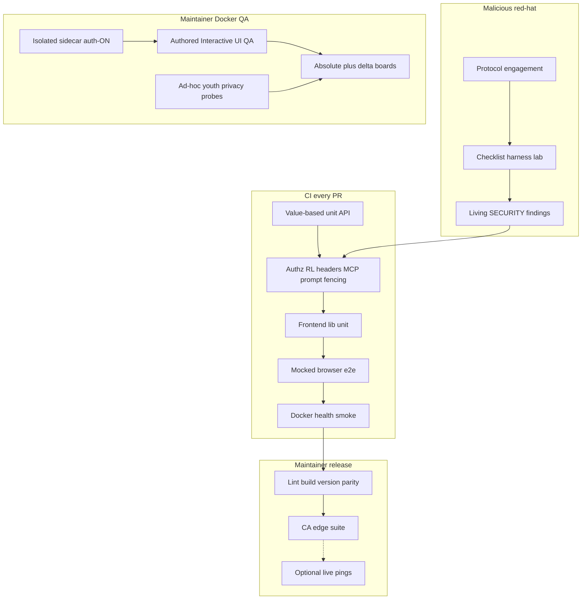

# Feature testing environment blueprint

**Status:** Active synthesis (Phase 1)  
**Date:** 2026-07-29  
**Audience:** Cursor agents and maintainers standing up CI + maintainer QA + red-hat pentest for a self-hosted product.

Normative text below is **product-agnostic**. Placeholders use `{CURLY}` names. Projectionist appears as worked examples and as **Appendix A** (full inventory) so another project can copy categories without porting our checklist IDs wholesale.

**Product-agnostic extract for other Cursor projects:** [Cursor QA environment design](./2026-07-29-cursor-qa-environment-design.md) (layers, doctrine, repo-as-authority surface inventory, authored-checklist-only UI QA, Cursor artifacts, standing-up playbook — no Projectionist inventory).

**Related (Projectionist):** [TESTING.md](../../../TESTING.md) · [docs/TESTING.md](../../TESTING.md) · [docs/SECURITY.md](../../SECURITY.md) · [docs/security/pentests/](../../security/pentests/) · [docs/RELEASE.md](../../RELEASE.md) · [`.cursor/skills/interactive-ui-qa/`](../../../.cursor/skills/interactive-ui-qa/)

---

## 1. Goals and non-goals

### Goals

1. **In-repo offline coverage that fails on wrong values** — not merely response shape.
2. **Maintainer auth-ON QA sidecar** for feature / role / youth-privacy UI campaigns.
3. **Repeatable malicious / red-hat engagement protocol** that feeds CI regressions and a living findings board.
4. **Honest release coupling** — required gates vs optional live / host campaigns, never against production.

### Non-goals

- Free-form click-around as a QA method (authored checklist IDs only for Interactive UI QA; incidental exploration must mint IDs).
- Testing on production (`{PROD_PORT}` / prod `{DATA_DIR}`).
- Mounting production config into the QA sidecar.
- Pretending CI covers live OAuth dances, LLM quality, or third-party host compromise.

---

## 2. Layered model (complete)



| Layer | What it proves | Cadence |
|-------|----------------|---------|
| Value-based unit / API | Exact counts, orderings, authz, fencing | Every PR |
| Frontend unit + SPA build | Lib contracts + compile gate | Every PR |
| Mocked browser e2e | Chrome paths without live secrets | Every PR |
| Docker health smoke | Image boots; `{HEALTH_PATH}` OK | Every PR (optional job) |
| CA / release edge suite | Empty-library / bootstrap honesty | Pre-tag |
| Interactive UI QA | Role/theme/gating on auth-ON sidecar | Maintainer campaigns |
| Pentest protocol + harness | Stable case IDs; perimeter → supply-chain | Periodic / major surface change |
| Living `{SECURITY_DOC}` board | Open / Mitigated / Accepted + residual | Continuous |

---

## 3. In-repo doctrine

### Value principle

> If your test would still pass when the function returns the wrong answer, it is not testing anything useful.

Shape-only assertions (`assert "items" in result`) miss wrong counts, wrong filters, and NULL handling. Prefer:

1. Ephemeral DB (temp `{DATA_DIR}` / SQLite file per test).
2. Explicit seed data (nullable fields set deliberately).
3. Real DB under test; mock only external HTTP APIs.
4. Exact assertions (`assertEqual` counts, titles, scores).
5. Empty / NULL / boundary cases.

### Coverage floor

Configure a **non-theatrical** floor in the package test config and CI (`{COV_FAIL_UNDER}`). Raise it when culture supports it; never advertise a number that CI does not enforce.

### Honest empties

Materialized caches and feeds must return empty lists **plus** explanatory notes when data is missing — never invent from adjacent fields. Tests assert both emptiness and note presence.

### Frontend unit + build gate

- Lib/unit suite without a browser (node test runner or equivalent).
- Production SPA build as the compile gate (and lint errors = 0 when a linter exists).

### Mocked e2e port hard-rule

Never reuse `{PROD_PORT}` for default mocked Playwright. Maintain a Cursor / agent rule that refuses prod for QA agents.

---

## 4. CI security / abuse regressions

Automate **categories**, not only happy paths. Adopters should copy these buckets into pytest (or equivalent):

| Category | What to assert |
|----------|----------------|
| Authz matrix | Unauth → 401; role escalation denied; owner-only surfaces 403 for member/guest |
| Rate limits + XFF trust | Throttles fire; forwarded headers ignored unless `{TRUST_PROXY_ENV}=1` |
| Security headers / OpenAPI | Frame/CSP/content-type; docs/`openapi.json` off by default |
| Error sanitization | No secrets / tracebacks in client JSON |
| Prompt-injection fencing | Untrusted repo / memory tool results delimited; system prompt clause present |
| Privacy MCP | Public schema on privacy key; dual-key full mode; equal keys refuse full |
| Session crypto / secrets-at-rest | Non-default session secret; encrypted UI secrets when keyed |
| Confirm-gated destructive writes | Propose → confirm token; guests cannot mutate |

**Regression bridge rule:** every Mitigated finding that is automatable **must** have a CI test. The periodic harness and CI must not permanently diverge on the same case ID.

---

## 5. Port hygiene

| Port placeholder | Typical use | Projectionist example |
|------------------|-------------|------------------------|
| `{PROD_PORT}` | Production / Docker host map / SSH tunnel trap | **8788** |
| `{E2E_PORT}` | Temp mocked Playwright server | **8799** |
| `{QA_PORT}` | Maintainer auth-ON Docker QA sidecar | **8790** |

Rules:

- Default e2e → `{E2E_PORT}` only.
- Interactive UI QA / role Playwright → `{QA_PORT}` only.
- Agents refuse `{PROD_PORT}` for QA; redirect to `{QA_PORT}`.
- Never mount prod `{DATA_DIR}` into the QA container.

---

## 6. Docker QA sidecar + Interactive UI QA

### Sidecar lifecycle (maintainer host)

| Concern | Rule |
|---------|------|
| Isolation | Separate container, host port `{QA_PORT}`, dedicated config volume |
| Auth | Multi-user **on**; seeded `{ROLE_MATRIX}` (owner / member / youth / guest / guest-tour) |
| Secrets | Host-local `.env.qa` (never commit; never echo into reports) |
| Redeploy | Path A (WIP image from build tree) / B (Hub tag) / C (restart only) — document on host |
| Idle policy | Stop QA after Hub publish unless a campaign is active; never stop prod |

Host-local runbooks stay **out of git** (pointers only). Projectionist: `/Volumes/appdata/projectionist-qa-scripts/qa-runs/QA-LIFECYCLE.md`, `QA-REDEPLOY.md`.

### Interactive UI QA skill

Two modes, checklist-only:

| Mode | When | Output |
|------|------|--------|
| `full` | Absolute baseline, major chrome, periodic audit | Overwrite `ABSOLUTE_BASELINE.md` + dated `*-full.md` |
| `delta` | After fix / scoped ship (default) | Dated `*-delta.md`; update open-bug board only |

Each authored ID has: **roles**, **tags**, **source**, **steps**, **pass**. Page-load alone is never PASS.

**Severity rubric:** `blocker` / `major` / `minor` / `polish`. Verdict FAIL if any blocker or major remains open.

**Youth / privacy / role-abuse-adjacent** checklist categories are the browser half of “red hat” — fail-closed content ceilings, Admin flash absence, guest tour isolation.

Artifacts live under host `{QA_RUNS_DIR}/` (gitignored). Never commit screenshots/passwords into the product repo.

---

## 7. Malicious red-hat / pentest layer

### Versioned PROTOCOL

Maintain `{PROTOCOL_DOC}` with:

- Threat model (trusted LAN, guest Wi‑Fi, accidental WAN, multi-user household).
- Surface inventory (routes, webhooks, MCP, uploads, packaging).
- Phases + **stable case ID taxonomy**.

Suggested prefixes:

| Phase | Prefixes |
|-------|----------|
| Perimeter | `TC-PERIM-*` |
| Auth / sessions / RL | `TC-AUTH-*`, `TC-AUTH-RL-*` |
| Injection / SSRF / XSS / upload | `TC-INJ-*`, `TC-SSRF-*`, `TC-XSS-*`, `TC-UPLOAD-*` |
| Authz / AI / MCP / prompt | `TC-AUTHZ-*`, `TC-MCP-*`, `TC-PROMPT-*` |
| Destructive / webhook / DoS | `TC-DEST-*`, `TC-WEBHOOK-*`, `TC-DOS-*` |
| Supply chain | `TC-SUPPLY-*` |

### Disposable lab only

- Temp `{DATA_DIR}`; synthetic settings; random non-dev session secret.
- Bind `127.0.0.1` for live servers; `{TRUST_PROXY_ENV}=0` unless testing proxy mode.
- OpenAPI exposure off for production-parity runs.
- Snapshot before destructive sub-phases; teardown after.

### YAML checklists + harness

```text
bootstrap-lab → (optional mocks) → run-checklist → results.json → teardown
new-engagement.sh → archive under docs/security/pentests/YYYY-MM-<slug>/
```

Harness writes `results.json` with protocol version, commit SHA, product version, and per-case pass/fail/skip.

### Living findings board

`{SECURITY_DOC}` table: ID · severity · location · exploit one-liner · **Open / Mitigated / Accepted** · residual risk.

Rules:

1. Engagement findings that become **Mitigated** must gain a CI regression when automatable.
2. Harness case status and CI must not permanently diverge (skip only with documented reason + reclassification path).
3. Operator residual risks (bind address, volume trust) may stay **Accepted** — document the pattern; do not pretend code fixed them.

### Optional advanced step

Soft-gate `results.json` diffs in CI, or a release-checklist checkbox that the harness is green on the ship tag (lab only). Prefer honesty over always-on CI cost for slow engagements.

---

## 8. Release coupling

| Gate | Required? | Notes |
|------|-----------|-------|
| Backend tests @ `{COV_FAIL_UNDER}` | Yes | Same floor locally and in CI |
| Frontend unit + build (+ lint 0 errors) | Yes | |
| Version lockstep | Yes | |
| Docs / CHANGELOG Highlights | Yes (user-facing) | |
| Mocked e2e | Yes in CI; confirm pre-tag | |
| CA edge suite | Recommended pre-CA / Hub | |
| Pentest harness green | **Recommended** for security-touching ships | Lab only |
| Interactive UI QA delta | **Recommended** for chrome / gating ships | `{QA_PORT}` only |
| Absolute UI baseline | Periodic / major chrome | Operator campaign |
| Live Plex OAuth / LLM quality | Optional | Document as out of CA |

After Hub publish: spin down QA sidecar unless a campaign is in progress. Never touch prod.

**Re-run pentest** after major authz / MCP / prompt / packaging surface changes, or on a periodic cadence (e.g. quarterly).

---

## 9. Copy vs invent + standing-up playbook

### Copy from this blueprint

- Layered model + port table + Cursor refuse-prod rule.
- Value-based test doctrine + coverage floor discipline.
- CI abuse-regression categories.
- PROTOCOL + harness + findings board loop.
- Interactive UI QA skill shape (modes, severity, authored IDs).

### Invent for your product

- Concrete checklist IDs and role matrix labels.
- Route surface matrix and threat notes.
- Host paths for QA volumes / seed scripts.
- Which findings are Accepted residual risk.

### Standing-up playbook (greenfield)

1. **CI skeleton** — unit + cov floor + frontend build + mocked e2e on `{E2E_PORT}`.
2. **Abuse suites** — authz, RL/XFF, headers, error sanitization, confirm gates.
3. **SECURITY board** — start empty; fill from first engagement.
4. **Protocol stub** — `PROTOCOL.md` v0.1 + one YAML checklist + harness that writes `results.json`.
5. **First engagement** — disposable lab; archive; promote Mitigated → CI tests.
6. **QA sidecar** — isolated volume, auth-ON, seed `{ROLE_MATRIX}`.
7. **Interactive UI QA skill** — 10–20 seed IDs (login + nav gating + one primary journey); expand with ships.
8. **Release runbook** — required vs recommended checkboxes; QA spin-down.

---

## Projectionist coverage & gaps

Verified 2026-07-29 against repo docs/tests (and host `qa-runs/` when mounted).

| Gap | Why it matters | Status | Phase 2 action |
|-----|----------------|--------|----------------|
| `TC-PROMPT-01` skipped in harness while pytest fencing exists | Harness/CI drift | **Closed** — harness runs `tests/test_prompt_injection.py` | Done |
| Architecture **M5** / ARCHITECTURE.md marked open | Doc drift after fencing | **Closed** — Mitigated + SECURITY S16 | Done |
| Pentest `results.json` not soft-gated in CI | Regressions between engagements | Soft-gated via RELEASE recommended checkbox (not always-on CI) | Done |
| Interactive UI QA / pentest not release-mandatory | Ships can skip role/abuse | RELEASE recommended checkboxes for chrome + security ships | Done |
| Household authz e2e partial (M9) | API + UI QA + opt-in QA Playwright cover most | **Deferred** — no small mocked-e2e win | Revisit on concrete UI hole |
| AGENTS.md cov floor / authz flake | Agents follow wrong numbers | **Closed** — 74% + `clear_rate_limits()` guidance | Done |
| Live Plex OAuth / LLM quality out of CA | Honest limit | Documented | Leave explicit |
| S3 / S11 residual (bind / volume trust) | Operator controls | Accepted on SECURITY board | Residual-risk pattern |
| New UI since last absolute baseline (~2026-07-25) | Inventory lag | Checklist IDs added; absolute baseline still operator | P2 remaining |

---

## Next for Projectionist (Phase 2 backlog — frozen)

Status updated as Phase 2 executed in-repo (2026-07-29).

### P0 — Close honesty gaps

1. ~~Align pentest harness `TC-PROMPT-01` with `tests/test_prompt_injection.py`~~ — **Done** (`run-checklist.py` subprocess pytest; YAML expected updated).
2. ~~Refresh `AGENTS.md`~~ — **Done** (cov floor **74%**; rate-limit clear guidance).
3. ~~Sync ARCHITECTURE + architecture review **M5**~~ — **Done** (Mitigated); SECURITY **S16** added.

### P1 — Coverage expansions

4. ~~Add Interactive UI QA IDs for post-1.28 surfaces~~ — **Done** (`admin.logs-surface`, `admin.storage-purge-type-pagination`, `admin.grooming-section-help`, `admin.removal-summary-dialog`, `explore.surprising-neighbors-showcase`).
5. ~~RELEASE.md recommended checkbox for pentest harness~~ — **Done** (Recommended table + agent checklist).
6. Expand household authz e2e / QA role coverage — **Deferred**. API authz (`test_api_authz.py`) + Interactive UI QA role matrix + opt-in `e2e/live-roles.spec.ts` (`CURATORX_E2E_QA_ROLES=1` on `:8790`) already cover the high-value paths; mocked Playwright login remains intentionally limited (no live OAuth). No small in-repo e2e win without expanding auth fixtures — revisit if a concrete UI hole appears.

### P2 — Process hardening

7. ~~RELEASE.md optional checkboxes for chrome ships (delta UI QA)~~ — **Done** (same Recommended table / agent checklist).
8. Fresh absolute baseline on `:8790` after checklist expansion — **Remaining operator step** (do not run a full campaign from this agent pass unless trivial).

---

## Appendix A — Projectionist full inventory

### A.1 Ports & environments

| Port | Role |
|------|------|
| 8788 | Prod / Docker / tunnel trap — **never** default e2e or Interactive UI QA |
| 8799 | Mocked Playwright (`scripts/start-e2e-server.mjs`) |
| 8790 | Maintainer QA sidecar `projectionist-qa` on `automat` (`http://10.10.1.202:8790`) |

Cursor rules: `.cursor/rules/e2e-port-8788.mdc`, Interactive UI QA skill hard-refuse of `:8788`.

### A.2 In-repo doctrine & coverage

- Root [TESTING.md](../../../TESTING.md) — value principle, ephemeral DB recipe, neighbors/explore patterns.
- Coverage: `pyproject.toml` `addopts` → `--cov-fail-under=74`; CI `.github/workflows/ci.yml` same floor.
- ~124 `tests/test_*.py` files including security-relevant:
  - `test_api_authz.py`, `test_rate_limit.py`, `test_security_headers.py`, `test_error_sanitization.py`
  - `test_prompt_injection.py` (TC-PROMPT-01 family)
  - `test_mcp_privacy.py`, `test_mcp_full_mode.py`, `test_library_privacy.py`
  - `test_crypto.py`, `test_session_tokens.py`, `test_ca_release.py`
- Frontend: `cd frontend && npm run test:unit` (+ `npm run lint` / `npm run build` at release).

### A.3 Mocked Playwright e2e

- Default: `npm run test:e2e` on **8799**; mocks in `e2e/fixtures/api-mocks.ts`.
- Suites include chat, setup/wizard, login (mocked Plex), CA release smoke, theme, recommendations/inbox, etc.
- Opt-in live: `CURATORX_E2E_LIVE=1`, `test:e2e:live-stack`.
- Opt-in QA roles: `e2e/live-roles.spec.ts` with `CURATORX_E2E_QA_ROLES=1` + `e2e/.auth/*.json` against **:8790** (maintainer).

### A.4 CI jobs

- `test`: pip install, frontend build + unit, pytest cov≥74, Playwright e2e.
- `docker-smoke`: build image, run container, `GET /api/health`.

### A.5 Interactive UI QA

- Skill: `.cursor/skills/interactive-ui-qa/SKILL.md` + `reference.md`.
- Inventory after Phase 2: **~94 authored IDs** (login → youth fail-closed filters, plus post-1.28 admin/explore IDs).
- Categories/tags: gating, nav, chat, explore, search, inbox, recommend, admin, persona, library, youth, lists, watchlist, …
- Host artifacts: `/Volumes/appdata/projectionist-qa-scripts/qa-runs/` (`ABSOLUTE_BASELINE.md`, `BASELINE.md`, dated campaign reports). Last absolute board dated ~2026-07-25.

### A.6 Pentest protocol & harness

- Protocol: [docs/security/pentests/PROTOCOL.md](../../security/pentests/PROTOCOL.md) **v1.0**.
- Index: [docs/security/pentests/README.md](../../security/pentests/README.md).
- Harness: `scripts/security/pentest/` (`bootstrap-lab.sh`, `run-checklist.py`, YAML checklists, `new-engagement.sh`).
- Baseline engagement archive: [2026-07-platform-full](../../security/pentests/2026-07-platform-full/) — historical **29 pass / 1 skip** (`TC-PROMPT-01`) on CuratorX 1.8.5.
- Current harness (2026-07-29 verify): **30 pass / 0 skip** — `TC-PROMPT-01` runs `tests/test_prompt_injection.py`; lab seed sets `invite_only=false` / `open_auto_provision=true` for synthetic Plex joins.
- Checklists: perimeter, perimeter-auth, injection, authz-ai-mcp, destructive-runtime, supply-chain (~30 cases).

### A.7 SECURITY findings board

- Living table in [docs/SECURITY.md](../../SECURITY.md): S1–S15, P1–P6.
- Notable residual **Accepted/Open operator**: S3 (bind `0.0.0.0`), volume/backup trust around S11.
- Prompt fencing landed in product + pytest; harness skip and architecture M5 were **doc/harness drift** at Phase 1 freeze (see Phase 2 P0).

### A.8 Release & host QA pointers

- [docs/RELEASE.md](../../RELEASE.md) — version parity, tests, Hub publish, QA spin-down.
- Host (not in git): `QA-LIFECYCLE.md`, `QA-REDEPLOY.md` under `projectionist-qa-scripts/qa-runs/`.
- Ad-hoc youth privacy probes historically lived as host scripts under `qa-runs/_probe_artifacts` / `_youth_fallback_probe*.sh`.

### A.9 Honest out-of-CA limits

- Full Plex OAuth PIN browser dance.
- Real library mutations against production Plex.
- End-to-end LLM chat quality (mocked chat in CI).
- Seerr member request path with live OAuth identity.

---

## Document history

| Date | Note |
|------|------|
| 2026-07-29 | Phase 1 synthesis: blueprint + Appendix A + gap matrix + frozen Phase 2 backlog |
| 2026-07-29 | Phase 2: P0/P1/P2 process items closed in-repo; absolute baseline on `:8790` remains operator |
| 2026-07-29 | Pointer to standalone product-agnostic [Cursor QA environment design](./2026-07-29-cursor-qa-environment-design.md) |
)
