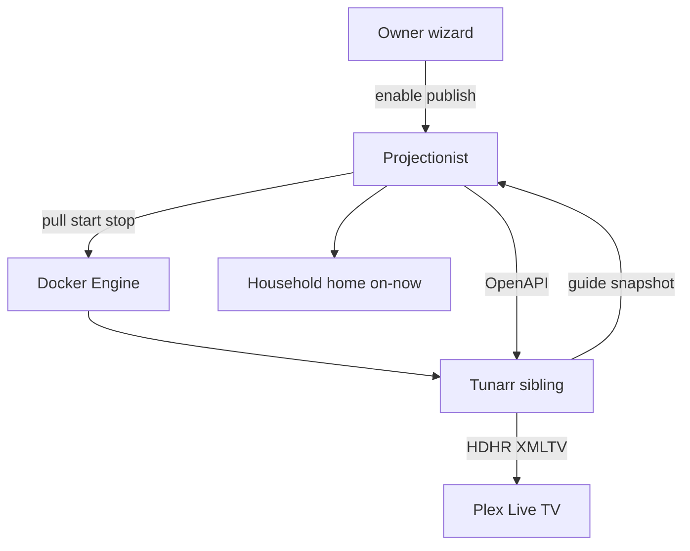

# Live Channels — Projectionist as Tunarr configurator

**Date:** 2026-07-29  
**Status:** Spec (pre-implementation)  
**Audience:** Developers / contributors shipping Live Channels  
**Related plan:** [2026-07-29-live-channels-tunarr.md](../plans/2026-07-29-live-channels-tunarr.md) · **Living deferred / discoveries:** [2026-07-29-live-channels-deferred.md](../plans/2026-07-29-live-channels-deferred.md) (park mid-build gaps there so they survive parallel work).

Projectionist fully manages a [Tunarr](https://github.com/chrisbenincasa/tunarr) sibling that feeds **Plex Live TV**. Owners get a guided enable wizard and library-aware programming; households get “on now” awareness. Plex remains the watch surface. This is not a Coax clone, not an in-app player, and not a full EPG product.

**Test bed:** Ops pilot and resource measurement happen on **Automat** (maintainer Unraid host). Product docs stay in-repo; host-local runbooks stay on Automat.

---

## 1. Product intent (locked)

| Decision | Choice |
|----------|--------|
| **Watch surface** | Plex Live TV only — no Projectionist player, no Coax-style app |
| **Broadcast engine** | Tunarr sibling (HDHomeRun + XMLTV → Plex) |
| **Projectionist role** | Sole management plane + delight layer (onboarding, recipes, household awareness) |
| **[Coax](https://coaxtheapp.com/#what-is-it)** | Config vocabulary reference only — not a UX to copy |
| **Tunarr UI** | Never a supported workflow — 100% OpenAPI from Projectionist |

---

## 2. Tunarr sibling AIO

Owner enables **Live Channels** via a guided wizard (feature flag + certified-service flow). Projectionist orchestrates a pinned Tunarr container beside the app.

| Mode | Behavior |
|------|----------|
| **ON** | Pull pinned `chrisbenincasa/tunarr:1.3.x`; start with `/config/tunarr` volume; poll health; wire Plex media source from Projectionist credentials; propose/publish starters; Plex attach checklist |
| **OFF** | Stop container; channels offline; **keep volume** (hand-tuned channels survive) |
| **No Docker socket** | Dynamic include unavailable — BYO Tunarr URL; same wizard from “wire” onward |

**Install weight (confirmed):** ~1GB amd64 image; always-transcode; Zlib; pin `1.3.x`; HDHR + `/api/xmltv.xml` for Plex. Tunarr admin is not published to the LAN (no Tunarr admin auth → keep admin off-LAN).

**Orchestration gate:** Docker socket (`PROJECTIONIST_DOCKER_ORCHESTRATION=1`, name TBD at implement time) required for dynamic pull/start/stop. Without it, only BYO URL path.

---

## 3. Zero Tunarr UI

- All channel and programming config goes through Tunarr’s OpenAPI from Projectionist.
- Tunarr admin UI is not a fallthrough for API gaps — gaps are Projectionist work.
- Channel-config vocabulary (lineups, collection channels, filters, fillers, shuffle/Chaos, exclusion lists) maps to Tunarr channels / programming / filler-lists.

---

## 4. Feature flip

Same optional-off pattern as Seerr and Plex collections:

- Add `features.live_channels_enabled` on `FeatureFlags` (default `false`).
- Expose via `GET /api/features` and Config toggles / wizard.
- Enable path is the **guided wizard**, not a naked toggle alone.
- Disable → stop sidecar, retain volume.

---

## 5. Delight v1 (must ship)

Core infra (toggle + Tunarr + publish) is necessary but not delightful. Delight = owners feel guided, households feel “TV is on,” and Projectionist’s taste brain does the programming people would otherwise fight Tunarr for.

### Owner

| Feature | Why it delights |
|---------|-----------------|
| **Guided enable wizard** | Preflight → pull/start with progress → wire Plex → propose starters → Plex attach checklist — one continuous story |
| **Preflight checks** | Docker orchestration available?; ~1GB disk?; Plex reachable?; Plex Pass called out honestly; GPU optional warning (soft-transcode OK for 1 stream). Fail early with fix copy |
| **Library-aware starter pack** | Propose 2–4 channels from *their* library (taste clusters, motifs, published collections/lists) plus one Chaos/shuffle and optional youth-safe. One-tap **Publish starters**. Empty demos are a miss |
| **Plain-language Plex attach** | Hide HDHR/XMLTV jargon behind “Add to Plex Live TV” steps + copy URLs; best-effort tuner discovery green-check |
| **Broadcast health strip** | Sidecar up/down, channel count, last publish, last error |
| **Collection → channel** | Reuse Plex collections propose/list path → publish as a station |

### Household (members / youth)

| Feature | Why it delights |
|---------|-----------------|
| **“On now” home card** | Read-only guide snapshot on Dashboard (beside Weekly Digest) / member weekly-rail slot. CTA opens Plex — **not** in-app playback |
| **Youth-safe recipes** | Apply existing youth rating gate + `YouthSettings.max_content_rating` when building playlists for youth-flagged accounts |
| **Ready / spotlight nudges** | Existing inbox `nudge` / `digest` kinds + `nudge_opt_in`; soft “Live Channels is on” / “starting soon” — dismissible, low volume |

### Strong candidates (same release if capacity; else immediate follow-on)

- Auto-refresh programming after library sync / arrivals
- Gap fillers from trailers/extras
- Channel number ranges (e.g. virtual 100+) to coexist with OTA HDHomeRun
- Owner “re-run starter pack” (additive; do not wipe hand-tuned channels)
- Ephemeral “tonight’s queue” shelf (TTL collection via ephemeral-collections GC)

### Explicitly later (not v1)

- Full newspaper-style guide / remote control in Projectionist
- Multi-lineup dayparts beyond simple shuffle/sequential
- Docker-less cloud installs as first-class AIO (BYO Tunarr only)
- Replacing Plex’s Live TV chrome

---

## 6. Reuse map

No Tunarr / Live TV code exists today. Build on existing patterns:

| Need | Reuse |
|------|--------|
| Feature flag | `FeatureFlags` + `GET /api/features` + ConfigPage toggles — `live_channels_enabled` like Seerr / collections |
| Owner enable UX | Extend `projectionist/web/setup.py` `CERTIFIED_SERVICES` / connection tests + Config onboarding wizard (`04-config-onboarding.css`) — not a second unrelated wizard |
| Starter recipes | Taste clusters, `GET /api/library/motifs`, Plot Lab filters in `library/query.py`, curated lists + `connectors/plex_collections.py` |
| Household surfaces | `DashboardPage` / `WeeklyDigestPanel`, inbox via `notifications/service.py`, `member_weekly_rail` / enthusiast nudge tasks |
| Youth | `youth/apply.py` + `youth/rating_gate.py` + Config Youth ceiling (`YouthSettings.max_content_rating`) |
| Plex Pass | **Gap:** only `server_identity` / machine-id today — add Pass / Live TV entitlement detection or explicit owner confirm in preflight |

---

## 7. Phased delivery

1. **Phase 0 — ops pilot (Automat):** Manual Tunarr → Plex; API-only programming; measure size / RAM / CPU; confirm OpenAPI covers config vocabulary.
2. **Phase 1 — recipes + OpenAPI client:** Taste / motif / collection → publish; youth gate on recipe build.
3. **Phase 2 — flag + wizard + Docker lifecycle:** `live_channels_enabled`, certified-service tests, preflight (incl. Pass honesty), pull progress, starter pack, health strip.
4. **Phase 3 — household delight:** On-now on Dashboard / weekly rail; inbox nudges.
5. **Plex attach:** Checklist + URL copy + discovery health (still one-time steps in Plex UI).

---

## 8. Out of scope

- Coax replacement / in-app watch / full EPG product
- Homegrown HDHomeRun emulator
- Embedding Tunarr in the Projectionist Python image
- Tunarr UI as a supported workflow
- Treating Automat host paths as in-repo product docs

---

## 9. How this works / honest limits

**How this works:** Projectionist owns config and recipes; Tunarr owns broadcast (mux, HDHR, XMLTV). Households watch in Plex Live TV. Projectionist reads a guide snapshot only to surface “on now,” never to play media.

**Limits:**

- Plex Pass / Live TV entitlement may need an honest manual confirm until detection lands.
- Without Docker orchestration, owners must supply their own Tunarr URL.
- Soft-transcode without GPU is acceptable for a single stream; multi-stream or heavy libraries may need GPU — called out in preflight, not blocked hard.
- Plex attach is still a one-time owner action inside Plex’s Live TV settings.

## See also

- [Implementation plan](../plans/2026-07-29-live-channels-tunarr.md)
- [Deferred & discoveries (living)](../plans/2026-07-29-live-channels-deferred.md) — product deferrals and post–Phase 1 engineering gaps
- [CONFIGURATION.md](../../CONFIGURATION.md) — feature-flag pattern for optional-off services
- [ARCHITECTURE.md](../../ARCHITECTURE.md) — system context
- [docs/DOCS_STYLE.md](../../DOCS_STYLE.md) — docs standard for later HELP / CONFIGURATION updates
