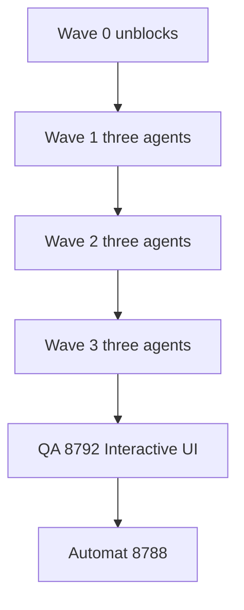

# Delight Phase 6 — 1.36 honesty, evening, owner story, scholar, craft

**Date:** 2026-09-24  
**Status:** Program spec (Wave 0 docs sprint = **v1.36.3**)  
**Audience:** Developers / Cursor agents shipping the 1.36 minor  
**Locked plan:** Cursor plan `persona_delight_top_10_a8ebd6a0` (`~/.cursor/plans/persona_delight_top_10_a8ebd6a0.plan.md`)  
**Wishlist pointer:** [DELIGHT-WISHLIST.md](../../DELIGHT-WISHLIST.md)

Prod today is **1.35.5**. This program is the **1.36** minor. Each sprint is a GitHub release (`v1.36.x` + feature title). **Automat prod waits until the full build is green on QA.** During the build we merge and tag GitHub (and Path-B Hub onto `:8792` if we need a live look). We do **not** `rollout.sh` prod per sprint.

North star: chat-first, explain-the-why, library you own, confirm-before-fleet.

**Hard locks**

| Lock | Rule |
|------|------|
| Live Plex sessions | No now-watching / session polling |
| Streaming availability | No Netflix / Max / “where else to watch” connectors |
| Public pages | No new unauthenticated product surfaces |
| smartmap | **Never stop** `:8790` to free a port. QA **never** binds `:8790` |
| QA | Ephemeral sidecar **`:8792`** only; spin down after the campaign |
| Prod | Automat `:8788` only at the **end gate**, pull-only `rollout.sh` |
| Plex | **Never Repair Plex** as a QA or agent action |
| Craft | No Postgres / Redis rewrite. No yanking `CURATORX_*` without a CA note. H8 embeddings only if measured |

---

## 1. Build orchestration

**Integration branch:** `release/1.36` from `main`. Every sprint is its own branch + PR **into `release/1.36`** (not colliding on `main` mid-program). One coordinator merges; CI must be green. Tag `v1.36.x` on `release/1.36` when that sprint’s PR merges.

**Worktrees:** one git worktree per live agent. No two agents in the same worktree.

### File locks (do not assign two live agents the same row)

| Files | Sprint order |
|-------|----------------|
| `projectionist/library/episode_investigate/**` + investigate routes | **v1.36.0** then **v1.36.1** |
| `frontend` Admin Libraries (extracted page, not ConfigPage after Wave 0) | **v1.36.0** then **v1.36.2** rematch |
| `frontend/src/pages/ExplorePage.jsx` + `projectionist/library/feeds.py` | **v1.36.4** then **v1.36.5** tonight’s table |
| `frontend/src/App.jsx` / `chatLayout` | **v1.36.5** remote + resume then **v1.36.9** shell carve |
| `projectionist/notifications/**` | **v1.36.2** Good News then **v1.36.5** whisper then **v1.36.7** gifts (or one agent owns notifications across waves) |
| `frontend/src/components/MessageText.jsx` + `village.py` + `syllabus/` | **v1.36.8** then **v1.36.9** walks |
| `docs/**` | **v1.36.3** (Wave 0, this sprint) |
| `ConfigPage.jsx` / `web/app.py` | **Wave 0 extract only**, then **Wave 3 remaining H1**. Never parallel with investigation UI still in ConfigPage |

**Coordinator loop (kickoff and every merge)**

1. Merge any green PR on `release/1.36`, tag GitHub for that sprint.
2. Launch every **unblocked** sprint whose file lock is free (up to ~3 agents).
3. Do not start v1.36.1 until v1.36.0 is merged. Do not start rematch (Libraries) until investigation UI has merged. Do not start App.jsx carve until v1.36.5 has merged.
4. Incremental QA on `:8792` is optional after a wave. **Prod stays 1.35.5 until the end gate.**

### End gate (full build)

1. All sprints merged on `release/1.36`; CHANGELOG complete; merge `release/1.36` → `main` (or keep tagging from the release branch per [RELEASE.md](../../RELEASE.md)).
2. Path B: Hub-publish the **final** 1.36 tag (or last sprint tag), pull onto QA **`:8792` only**.
3. **Interactive UI QA** (`.cursor/skills/interactive-ui-qa/SKILL.md`): member + owner, desktop + **390×844**, authored checklists covering Investigate, rematch, evening, owner letter, scholar, plus mobile chrome. Fix/re-verify on QA. Never `:8788`, never `:8790`.
4. When you are happy: Automat prod **pull-only** `rollout.sh` on `:8788`. Spin QA down. smartmap stays up.

**During sprints:** PR → `release/1.36` → GitHub tag. Optional Hub image for that tag **only** to pull QA `:8792`. Never prod `:8788`. Never `:8790`.

Tokens: one gold primary per admin region; phone composer pinned.

---

## 2. Release map (GitHub tags)

### Wave 0 — kickoff (parallel, unblocks)

| Tag | Title | Owns |
|-----|-------|------|
| **v1.36.3** | Craft hygiene | `docs/**` only (this spec, wishlist pointer, deferred-doc truth-up, CuratorX keep-vs-sunset). No ConfigPage / `app.py` / frontend component edits. |
| *(unblocks A)* | Admin Libraries extract | First slice of H1: move Libraries UI out of ConfigPage; add empty `investigate_routes.py`. Same wave as 1.36.3 or the first commit of 1.36.0. Unblocks investigation without two agents editing ConfigPage / `app.py`. |

### Wave 1 — parallel (three agents, after Wave 0 locks are free)

| Tag | Title | Owns |
|-----|-------|------|
| **v1.36.0** | Episode investigation | `episode_investigate/**` + Libraries page |
| **v1.36.4** | Afterglow and unfinished | Explore / feeds + review afterglow. Not Libraries. |
| **v1.36.8** | Scholar core | MessageText, village, syllabus. Not App.jsx. |

### Wave 2 — parallel after Wave 1 merges

| Tag | Title | Owns |
|-----|-------|------|
| **v1.36.1** | Identify lanes | ACRCloud on `episode_investigate/**` |
| **v1.36.2** | Rematch and Good News | Libraries page + notifications (if whisper not started) |
| **v1.36.5** | Whisper and tonight | App.jsx remote / resume, Explore tonight’s table (after 1.36.4), whisper inbox |

### Wave 3 — parallel after Wave 2

| Tag | Title | Owns |
|-----|-------|------|
| **v1.36.7** | House letter and gifts | Owner letter, seasonal preview + veto, gift queue, trust diary |
| **v1.36.9** | Scholar walks | Lineage, canon, map, compare, seminar, gap list |
| *(remaining H1)* | Config / shell carve | Rest of ConfigPage / `app.py` split + App.jsx shell (**after** 1.36.5) |

---

## 3. Phase A — Honesty and identity

### v1.36.0 — Episode investigation

Owner picks a show (optional season) → **Investigate**. Scene names are not evidence.

**Always:** ffmpeg stills vs TMDB episode stills; OSHash → OpenSubtitles; runtime. Filename / Sonarr `SxxEyy` = left column only.

**Vision default (fusion):** if the chat LLM accepts images, fusion includes vision unless the owner toggles it off. Three stills, constrained JSON (`this series` → household shows → `unknown`). Stills **leave the LAN**; copy says so.

**UI:** side-by-side, stills pair, Certain / Likely selected, Uncertain off, deselect, Apply or Cancel. Apply this sprint: **same show only** (Sonarr episode-file remap + Plex-proper names + Plex refresh + undo). Job progress like missing-search.

**ffmpeg** in the image or a documented host binary.

### v1.36.1 — Identify lanes (ACRCloud)

**Service:** ACRCloud **Identification API** (Music / Audio Recognition project). Not Broadcast Monitoring. Not Custom File Scan.

- Connections: region host + `access_key` / `access_secret` (encrypted; env wins). Test clip, no rename.
- Clip: ~12s audio from **40%** in (`ffmpeg` wav, under Identify size cap), HMAC POST `/v1/identify`.
- Result is usually **show-level** (theme / score). Stills / vision pick the episode. Map ACR title → TMDB; else Uncertain evidence.
- Rate-limit per file; one Identify per episode; a miss does not fail the job.
- **New-show prompt:** if fusion says a series not in Plex / Sonarr, applying would create / attach — owner opts in per row.

### v1.36.2 — Rematch and Good News

- **Rematch studio** — movies: Plex GUID vs Radarr TMDB vs folder (Presence / Savages). Same title vs path conflict.
- **Repair the miss** — failed search / register: rematch, skip, retry, Investigate. Human copy, no JSON dump.
- **Good News** — watchlist / gap arrival in persona voice, not “download complete.”

FileBot / Plex Match / Gracenote are not investigators. Audible Magic is stretch only.

---

## 4. Phase B — Adult evening

**v1.36.4:** Afterglow uses the existing review dialogue (`projectionist/persona/presets.py`). Unfinished rail is distinct from Revisit These (60-day idle).

**v1.36.5:** Whisper → named member inbox, 12-word why. Phone Play to a Plex client; composer stays pinned. Holdable shelf = Save to library without extra H1. Resume chip on chat home. Tonight’s table = under 2h, two unwatched, one comfort.

---

## 5. Phase C — Owner story

**v1.36.7:** Letter, not tiles (unwatched hours, dead weight, disk). Seasonal rails already exist — add preview + veto. Gift queue reuses the nudge / newsletter scheduler. Trust diary links rematch / Investigate / job cards.

---

## 6. Phase D — Scholar

**v1.36.8:** Footnote sheet from `[^1]`; village pending → “they have not called back”; course resume pointer (`projectionist/syllabus/`).

**v1.36.9:** Lineage, canon, map, compare-two-rated, silent seminar, consented gap reading list.

---

## 7. Phase E — Craft

Still in this program. **Wave 0:** v1.36.3 hygiene (this document) + Libraries extract (sibling). **Wave 3:** rest of ConfigPage / `app.py` + App.jsx shell (after 1.36.5).

### CuratorX keep-vs-sunset (do not yank aliases in 1.36.3)

In-app branded env resolution is **`PROJECTIONIST_*` only** as of **1.34.0** (`projectionist/envcompat.py` `CANONICAL_PREFIX`). That ship already dropped webhook `X-CuratorX-*`, `curatorx.*` localStorage migration, the `romwil/curatorx` Hub dual-tag, and the `find_collection_gaps` MCP alias.

| Layer | Disposition | Why |
|-------|-------------|-----|
| `projectionist/envcompat.py` | **Keep** (already sunset) | Canonical prefix only. Do not re-add dual-read. |
| Compose / Unraid `${CURATORX_*:-}` shell fallbacks | **Keep** until a CA note | `docker-compose.yml`, `docker-compose.unraid.yml`, `docker-compose.qa.yml`, `scripts/unraid-rollout.sh` still map old names into `PROJECTIONIST_*` so existing appdata `.env` files boot. Yanking this is a Community Applications breaking change. |
| Leftover in-process `CURATORX_LOG_MAX_BYTES` / `CURATORX_LOG_BACKUP_COUNT` | **Keep** until a CA / CHANGELOG note | `logging_config.py` still dual-reads these two. Do not silently drop. |
| Scripts that *set* `CURATORX_SKIP_DOTENV` (`start-e2e-server.*`, pentest lab) | **Sunset later** (docs + script PR) | `skip_dotenv()` only reads `PROJECTIONIST_SKIP_DOTENV`. Those scripts are currently setting a name the app ignores. |
| FAQ / MCP “compatibility window” copy | **Sunset the claim** (this sprint) | Window closed in 1.34.0 for in-app reads. Compose-layer mapping is not a promise for new installs. |
| Pentest harness `CURATORX_*` fixtures | **Keep** | Historical lab scripts; not product config. |
| User-facing docs that still say `YOUR_CURATORX_HOST` | **Sunset later** | CONFIGURATION webhook examples; not this Wave 0 pass. |

**Rule for later sprints:** do not delete `CURATORX_*` names from templates, rollout, or CA XML without an Unraid CA note and a CHANGELOG Breaking line.

### Architecture letter (still open, verified 2026-09-24)

Refresh only — do not rewrite [2026-07-architecture-code-review.md](../../reviews/2026-07-architecture-code-review.md). Verified against `main` @ 1.35.5 (`a4e7183`):

| ID | Still open? | Evidence |
|----|-------------|----------|
| **H1** | Yes (partial) | `web/app.py` ~7244 lines, `ConfigPage.jsx` ~3803, `App.jsx` ~2025. Incremental carves already landed (`live_channels_routes.py`, `LiveChannelsSection.jsx`, `HouseholdSection.jsx`). 1.36 Wave 0 extracts Libraries; Wave 3 finishes remaining H1. |
| **H8** | Yes | `get_embeddings()` still `json.loads` of TEXT vectors. Optional sqlite-vec ANN is a prefilter only. Expand only if measured. |
| **M3 / M6 / M8** | Yes | Jittered connector retries, persist-quarantine + wall-clock deadline, remaining god-component extraction. |
| **M10** | Snapshot landed | `GET /api/admin/backup/snapshot` is on trunk (CHANGELOG Phase E stretch). Docs row can say snapshot shipped; do not treat “Admin snapshot deferred” as current. |
| **H4 / H5 / M1 / M2 / M4 / M5 / M7 / H6 / H7 / M12** | Already marked Done / Mitigated | Leave those rows; no rewrite. |

---

## 8. Locked backlog (maps onto the releases)

**Owner:** rematch studio (1.36.2); episode investigation (1.36.0–1); house as story; seasonal preview; gift queue; trust diary (1.36.7).

**Adult:** afterglow; whisper; unfinished; phone remote; holdable shelf; Good News (1.36.2 + 1.36.4–5).

**Scholar:** syllabus resume; footnotes; lineage; canon; map; compare; seminar; gap list; unsourced (1.36.8–9).

**Concierge:** tonight’s table (1.36.5); repair the miss (1.36.2).

**Companion:** we already talked (1.36.5).

**Dropped from this program:** Youth / Guest / Spark doors, hospitality night switch, quiet hours.

---

## 9. See also

- [DELIGHT-WISHLIST.md](../../DELIGHT-WISHLIST.md) — historical Phases 1–5; Phase 6 points here
- [RELEASE.md](../../RELEASE.md) — Hub-first ship path
- [AUTOMAT.md](../../ops/AUTOMAT.md) — prod `:8788`, smartmap `:8790`, QA `:8792`
- [2026-07-29-live-channels-deferred.md](../plans/2026-07-29-live-channels-deferred.md) — residual Live trust (hygiene-reconciled 2026-09-24)
- Interactive UI QA skill: `.cursor/skills/interactive-ui-qa/SKILL.md`
